# How Claude Code Works — Architecture Deep Dive

> A comprehensive visual walkthrough of every major system inside Claude Code, based on reading the full open-sourced TypeScript codebase (1,903 files, 33MB). Covers internal mechanics, exact thresholds, prompts, and design decisions.

---

## Table of Contents

1. [High-Level Architecture](#1-high-level-architecture)
2. [Startup & Initialization](#2-startup--initialization)
3. [The Agent Loop](#3-the-agent-loop)
4. [Streaming & SSE Pipeline](#4-streaming--sse-pipeline)
5. [Tool System](#5-tool-system)
6. [Tool Implementations](#6-tool-implementations)
7. [System Prompt Assembly](#7-system-prompt-assembly)
8. [Context Management — 5 Layers](#8-context-management--5-layers)
9. [Token Estimation & Budget](#9-token-estimation--budget)
10. [Subagent / Multi-Agent System](#10-subagent--multi-agent-system)
11. [Permission System](#11-permission-system)
12. [Hook System](#12-hook-system)
13. [Memory System](#13-memory-system)
14. [Skills System](#14-skills-system)
15. [Task System](#15-task-system)
16. [Terminal UI Architecture](#16-terminal-ui-architecture)
17. [Cost Tracking](#17-cost-tracking)
18. [MCP Integration](#18-mcp-integration)
19. [Session & State Management](#19-session--state-management)
20. [The Verification Agent](#20-the-verification-agent)

---

## 1. High-Level Architecture

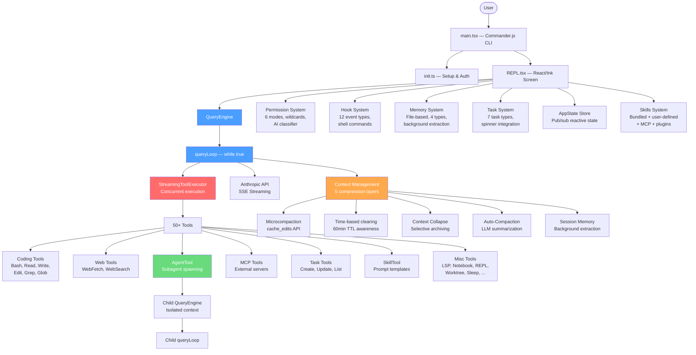
```mermaid
graph TB
    User([User]) --> CLI[main.tsx — Commander.js CLI]
    CLI --> Init[init.ts — Setup & Auth]
    CLI --> REPL[REPL.tsx — React/Ink Screen]

    REPL --> QE[QueryEngine]
    QE --> QL[queryLoop — while true]

    QL --> CTX[Context Management<br>5 compression layers]
    QL --> API[Anthropic API<br>SSE Streaming]
    QL --> STE[StreamingToolExecutor<br>Concurrent execution]

    STE --> Tools[50+ Tools]
    Tools --> Coding[Coding Tools<br>Bash, Read, Write,<br>Edit, Grep, Glob]
    Tools --> Web[Web Tools<br>WebFetch, WebSearch]
    Tools --> Agent[AgentTool<br>Subagent spawning]
    Tools --> MCPTools[MCP Tools<br>External servers]
    Tools --> TaskTools[Task Tools<br>Create, Update, List]
    Tools --> SkillT[SkillTool<br>Prompt templates]
    Tools --> Misc[Misc Tools<br>LSP, Notebook, REPL,<br>Worktree, Sleep, ...]

    Agent --> QE2[Child QueryEngine<br>Isolated context]
    QE2 --> QL2[Child queryLoop]

    CTX --> MC[Microcompaction<br>cache_edits API]
    CTX --> TB[Time-based clearing<br>60min TTL awareness]
    CTX --> CC[Context Collapse<br>Selective archiving]
    CTX --> AC[Auto-Compaction<br>LLM summarization]
    CTX --> SM[Session Memory<br>Background extraction]

    REPL --> Perm[Permission System<br>6 modes, wildcards,<br>AI classifier]
    REPL --> Hooks[Hook System<br>12 event types,<br>shell commands]
    REPL --> Mem[Memory System<br>File-based, 4 types,<br>background extraction]
    REPL --> Tasks[Task System<br>7 task types,<br>spinner integration]
    REPL --> State[AppState Store<br>Pub/sub reactive state]
    REPL --> Skills[Skills System<br>Bundled + user-defined<br>+ MCP + plugins]

    style QE fill:#4a9eff,color:#fff
    style QL fill:#4a9eff,color:#fff
    style STE fill:#ff6b6b,color:#fff
    style CTX fill:#ffa94d,color:#fff
    style Agent fill:#69db7c,color:#fff
```

The codebase is roughly organized as:

| Directory | Purpose | Approx size |
|-----------|---------|-------------|
| `ink/` | Custom React reconciler + terminal rendering engine | ~8,000 lines |
| `tools/` | 50+ tool implementations | ~12,000 lines |
| `services/` | MCP, compact, memory, analytics, OAuth, plugins | ~10,000 lines |
| `utils/` | Permissions, hooks, settings, file ops | ~8,000 lines |
| `components/` | React UI components | ~5,000 lines |
| `screens/` | REPL, Doctor, Resume screens | ~3,000 lines |
| `query.ts` + `QueryEngine.ts` | Core agent loop | ~4,500 lines |
| `constants/` | System prompts, model config, tools config | ~2,000 lines |
| `state/` | App state management | ~1,500 lines |
| `keybindings/` | Keyboard shortcut system | ~1,000 lines |

---

## 2. Startup & Initialization

The startup sequence in `main.tsx` (4,683 lines) is heavily optimized for speed — several expensive operations run in parallel before imports even finish:

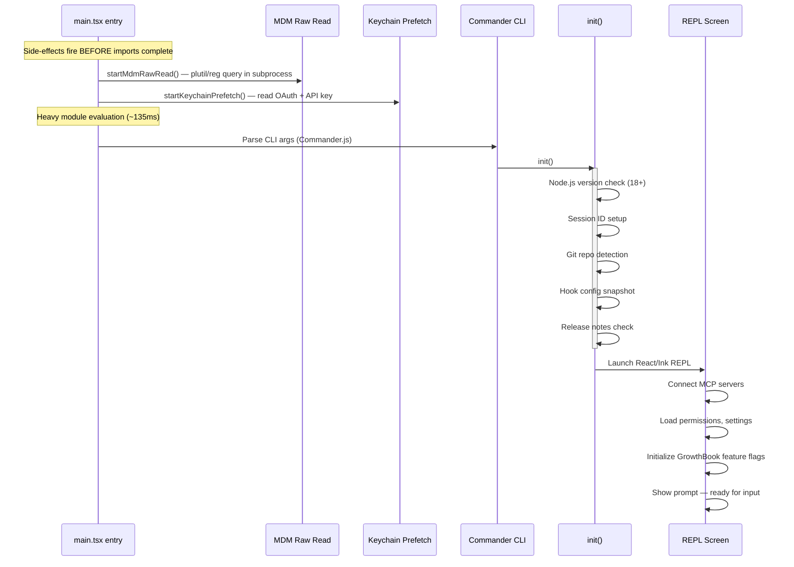
```mermaid
sequenceDiagram
    participant Entry as main.tsx entry
    participant MDM as MDM Raw Read
    participant KC as Keychain Prefetch
    participant CLI as Commander CLI
    participant Init as init()
    participant REPL as REPL Screen

    Note over Entry: Side-effects fire BEFORE imports complete
    Entry->>MDM: startMdmRawRead() — plutil/reg query in subprocess
    Entry->>KC: startKeychainPrefetch() — read OAuth + API key

    Note over Entry: Heavy module evaluation (~135ms)
    Entry->>CLI: Parse CLI args (Commander.js)

    CLI->>Init: init()
    activate Init
    Init->>Init: Node.js version check (18+)
    Init->>Init: Session ID setup
    Init->>Init: Git repo detection
    Init->>Init: Hook config snapshot
    Init->>Init: Release notes check
    deactivate Init

    Init->>REPL: Launch React/Ink REPL
    REPL->>REPL: Connect MCP servers
    REPL->>REPL: Load permissions, settings
    REPL->>REPL: Initialize GrowthBook feature flags
    REPL->>REPL: Show prompt — ready for input
```

**Key optimization**: MDM settings reads (macOS `plutil` subprocess) and keychain reads (OAuth token + legacy API key) are fired as the very first lines, before the ~135ms of import evaluation. By the time imports finish, the subprocesses have completed.

---

## 3. The Agent Loop

The core of Claude Code is split into two layers: `QueryEngine` (session owner) and `query()` (inner loop).

### QueryEngine (`QueryEngine.ts`, 46KB)

Owns the session lifecycle:
- `mutableMessages[]` — in-memory message buffer
- `submitMessage()` — async generator that yields `SDKMessage` types
- Manages compact boundaries, permission tracking, transcript recording
- Wraps `canUseTool()` callback to track permission denials
- One QueryEngine per conversation; subagents get their own isolated instances

### queryLoop() (`query.ts`, 68KB)

The inner `while(true)` loop (line 307). Each iteration = one LLM turn:

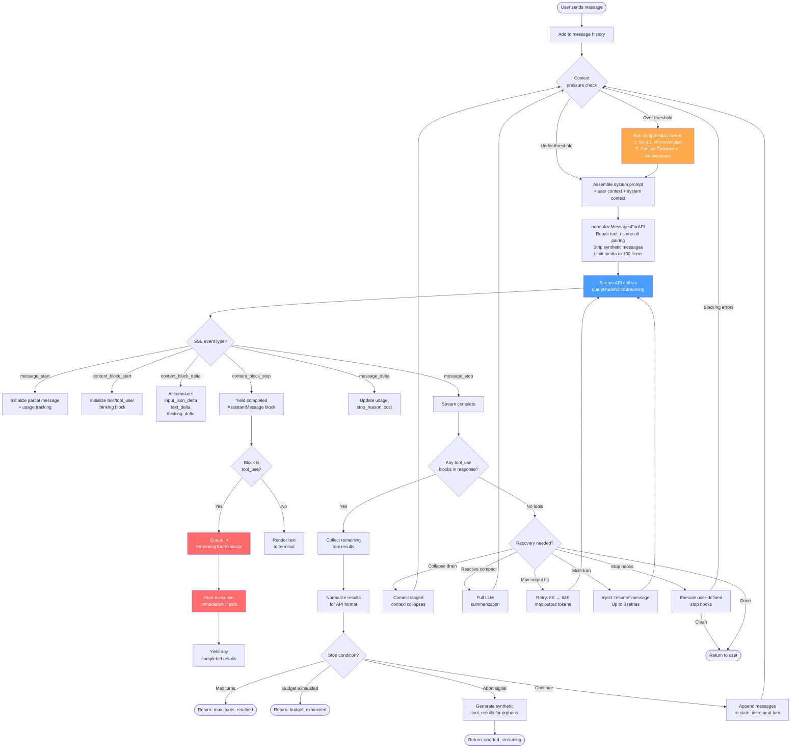
```mermaid
flowchart TD
    Start([User sends message]) --> AddMsg[Add to message history]
    AddMsg --> PreFlight{Context<br>pressure check}

    PreFlight -->|Under threshold| Prompt[Assemble system prompt<br>+ user context + system context]
    PreFlight -->|Over threshold| Layers[Run compression layers:<br>1. Snip 2. Microcompact<br>3. Context Collapse 4. Autocompact]
    Layers --> Prompt

    Prompt --> Normalize[normalizeMessagesForAPI<br>Repair tool_use/result pairing<br>Strip synthetic messages<br>Limit media to 100 items]
    Normalize --> Stream[Stream API call via<br>queryModelWithStreaming]

    Stream --> EventLoop{SSE event type?}

    EventLoop -->|message_start| InitMsg[Initialize partial message<br>+ usage tracking]
    EventLoop -->|content_block_start| InitBlock[Initialize text/tool_use/<br>thinking block]
    EventLoop -->|content_block_delta| Accum[Accumulate:<br>input_json_delta<br>text_delta<br>thinking_delta]
    EventLoop -->|content_block_stop| YieldBlock[Yield completed<br>AssistantMessage block]
    EventLoop -->|message_delta| UpdateUsage[Update usage,<br>stop_reason, cost]
    EventLoop -->|message_stop| StreamDone[Stream complete]

    YieldBlock --> HasToolUse{Block is<br>tool_use?}
    HasToolUse -->|Yes| QueueTool[Queue in<br>StreamingToolExecutor]
    HasToolUse -->|No| RenderText[Render text<br>to terminal]

    QueueTool --> ExecImmediate[Start execution<br>immediately if safe]
    ExecImmediate --> CollectReady[Yield any<br>completed results]

    StreamDone --> AnyTools{Any tool_use<br>blocks in response?}
    AnyTools -->|Yes| Remaining[Collect remaining<br>tool results]
    Remaining --> NormResults[Normalize results<br>for API format]
    NormResults --> CheckStop{Stop condition?}

    CheckStop -->|Max turns| Terminal1([Return: max_turns_reached])
    CheckStop -->|Budget exhausted| Terminal2([Return: budget_exhausted])
    CheckStop -->|Abort signal| HandleAbort[Generate synthetic<br>tool_results for orphans]
    HandleAbort --> Terminal3([Return: aborted_streaming])
    CheckStop -->|Continue| NextTurn[Append messages<br>to state, increment turn]
    NextTurn --> PreFlight

    AnyTools -->|No tools| Recovery{Recovery needed?}
    Recovery -->|Collapse drain| DrainCollapse[Commit staged<br>context collapses]
    DrainCollapse --> PreFlight
    Recovery -->|Reactive compact| ReactiveCompact[Full LLM<br>summarization]
    ReactiveCompact --> PreFlight
    Recovery -->|Max output hit| Escalate[Retry: 8K → 64K<br>max output tokens]
    Escalate --> Stream
    Recovery -->|Multi-turn| Resume["Inject 'resume' message<br>Up to 3 retries"]
    Resume --> Stream
    Recovery -->|Stop hooks| RunHooks[Execute user-defined<br>stop hooks]
    RunHooks -->|Blocking errors| PreFlight
    RunHooks -->|Clean| Terminal4([Return to user])
    Recovery -->|Done| Terminal4

    style Stream fill:#4a9eff,color:#fff
    style QueueTool fill:#ff6b6b,color:#fff
    style ExecImmediate fill:#ff6b6b,color:#fff
    style Layers fill:#ffa94d,color:#fff
```

### Loop State

The loop maintains explicit state that carries between iterations:

```typescript
type State = {
  messages: Message[]                           // Full conversation
  toolUseContext: ToolUseContext                 // Tools, permissions, abort controller
  autoCompactTracking: AutoCompactTrackingState  // Compaction metrics
  maxOutputTokensRecoveryCount: number          // Max-output retries (0-3)
  hasAttemptedReactiveCompact: boolean          // Prevent compact spirals
  turnCount: number                             // Current turn number
  transition: Continue | undefined              // Why we continued (next_turn, collapse_drain_retry, etc.)
  pendingToolUseSummary: Promise<...> | undefined
  stopHookActive: boolean | undefined
  maxOutputTokensOverride: number | undefined
}
```

### Recovery Decision Tree

When the LLM responds without any tool_use blocks but the task isn't done, Claude Code has a sophisticated recovery chain:

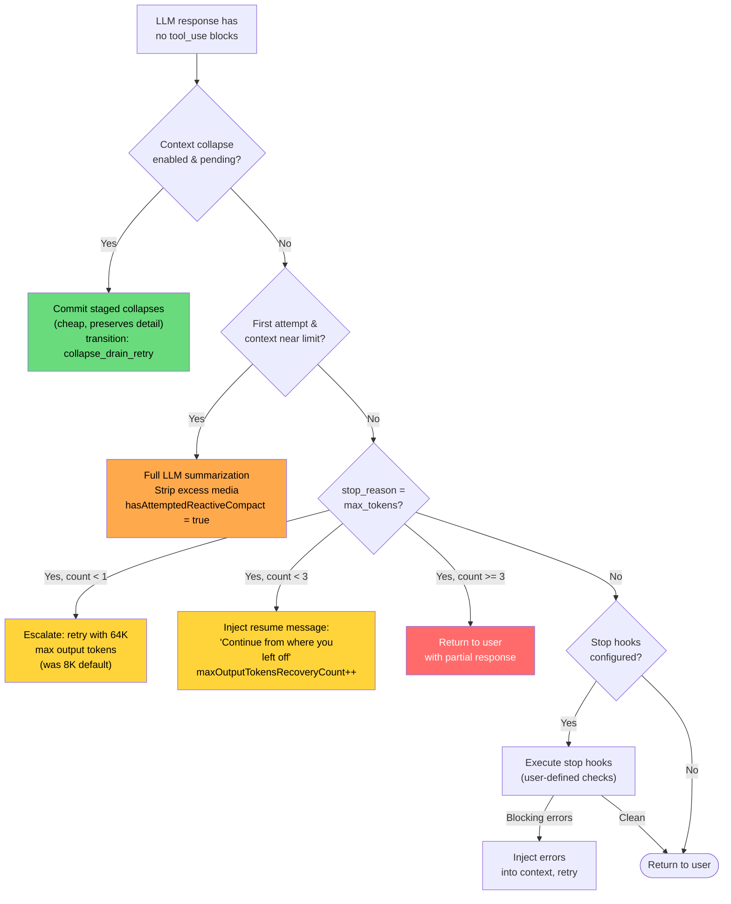
```mermaid
flowchart TD
    NoTools[LLM response has<br>no tool_use blocks] --> CollapseCheck{Context collapse<br>enabled & pending?}

    CollapseCheck -->|Yes| DrainCollapse["Commit staged collapses<br>(cheap, preserves detail)<br>transition: collapse_drain_retry"]
    CollapseCheck -->|No| ReactiveCheck{First attempt &<br>context near limit?}

    ReactiveCheck -->|Yes| ReactiveCompact["Full LLM summarization<br>Strip excess media<br>hasAttemptedReactiveCompact = true"]
    ReactiveCheck -->|No| MaxOutputCheck{stop_reason =<br>max_tokens?}

    MaxOutputCheck -->|Yes, count < 1| Escalate["Escalate: retry with 64K<br>max output tokens<br>(was 8K default)"]
    MaxOutputCheck -->|Yes, count < 3| MultiTurn["Inject resume message:<br>'Continue from where you<br>left off'<br>maxOutputTokensRecoveryCount++"]
    MaxOutputCheck -->|Yes, count >= 3| GiveUp[Return to user<br>with partial response]
    MaxOutputCheck -->|No| StopHooks{Stop hooks<br>configured?}

    StopHooks -->|Yes| RunHooks["Execute stop hooks<br>(user-defined checks)"]
    RunHooks -->|Blocking errors| InjectErrors["Inject errors<br>into context, retry"]
    RunHooks -->|Clean| Done([Return to user])
    StopHooks -->|No| Done

    style DrainCollapse fill:#69db7c,color:#000
    style ReactiveCompact fill:#ffa94d,color:#000
    style Escalate fill:#ffd43b,color:#000
    style MultiTurn fill:#ffd43b,color:#000
    style GiveUp fill:#ff6b6b,color:#fff
```

---

## 4. Streaming & SSE Pipeline

### API Integration (`claude.ts`)

Claude Code uses the Anthropic SDK directly, creating a streaming request:

```typescript
const result = await anthropic.beta.messages.create(
  { ...params, stream: true },
  { signal, headers: { [CLIENT_REQUEST_ID_HEADER]: clientRequestId } }
).withResponse()
```

It then iterates the raw stream events directly (NOT using the SDK's `BetaMessageStream` helper), giving full control over each SSE event.

### SSE Event Processing

```mermaid
sequenceDiagram
    participant API as Anthropic API
    participant Parser as SSE Parser
    participant Loop as Event Handler
    participant UI as Terminal UI
    participant STE as StreamingToolExecutor

    API->>Parser: data: {"type": "message_start", ...}
    Parser->>Loop: message_start
    Loop->>Loop: Initialize partialMessage, usage tracking

    API->>Parser: data: {"type": "content_block_start", "content_block": {"type": "thinking"}}
    Parser->>Loop: content_block_start (thinking)
    Loop->>UI: Show "Thinking..." spinner

    API->>Parser: data: {"type": "content_block_delta", "delta": {"thinking": "Let me..."}}
    Parser->>Loop: thinking_delta
    Loop->>Loop: Accumulate thinking text (not shown to user)

    API->>Parser: data: {"type": "content_block_stop"}
    Parser->>Loop: content_block_stop (thinking)
    Loop->>UI: Show thinking duration "Thinking (2.3s)"

    API->>Parser: data: {"type": "content_block_start", "content_block": {"type": "text"}}
    Parser->>Loop: content_block_start (text)

    API->>Parser: data: {"type": "content_block_delta", "delta": {"text": "I'll search"}}
    Parser->>Loop: text_delta
    Loop->>UI: Render partial text token-by-token

    API->>Parser: data: {"type": "content_block_start", "content_block": {"type": "tool_use", "name": "Grep"}}
    Parser->>Loop: content_block_start (tool_use: Grep)

    API->>Parser: data: {"type": "content_block_delta", "delta": {"partial_json": "{\"pattern\":"}}
    Parser->>Loop: input_json_delta
    Loop->>Loop: Concatenate to partial input string

    API->>Parser: data: {"type": "content_block_stop"}
    Parser->>Loop: content_block_stop (tool_use: Grep)
    Loop->>Loop: Parse accumulated JSON → tool input
    Loop->>STE: addTool(grep block)
    STE->>STE: Start Grep execution immediately

    Note over API,STE: Model is STILL generating more blocks...

    API->>Parser: data: {"type": "content_block_start", "content_block": {"type": "tool_use", "name": "Read"}}
    Note over STE: Grep may already be DONE by now

    API->>Parser: data: {"type": "message_delta", "delta": {"stop_reason": "tool_use"}, "usage": {...}}
    Parser->>Loop: message_delta
    Loop->>Loop: Update final usage, stop_reason, cost

    API->>Parser: data: {"type": "message_stop"}
    Parser->>Loop: Streaming complete
```

### Idle Timeout Watchdog

A configurable watchdog kills stalled streams:

```
Default: 90 seconds (STREAM_IDLE_TIMEOUT_MS)
Override: CLAUDE_STREAM_IDLE_TIMEOUT_MS env var
Behavior: Timer resets on every chunk. If no events arrive within timeout → abort stream.
```

### Streaming Fallback

If the stream errors (not user abort), Claude Code retries as a **non-streaming** request:
- Max 64K tokens for non-streaming (`MAX_NON_STREAMING_TOKENS`)
- Partially-streamed messages are **tombstoned** (invalidated in the UI)
- The StreamingToolExecutor is discarded and a fresh one is created
- All partially-executed tools get synthetic error results

---

## 5. Tool System

### Tool Interface (`Tool.ts`, 30KB)

Every tool conforms to a rich generic interface:

```typescript
Tool<Input extends ZodSchema, Output extends ZodSchema, Progress> = {
  // Identity
  name: string
  userFacingName(input): string
  description(input): string

  // Schemas (lazy-evaluated for token efficiency)
  inputSchema: ZodSchema           // Validated before execution
  outputSchema: ZodSchema          // Typed output

  // Execution
  call(input, context, canUseTool, parentMessage, onProgress): Promise<{data: Output}>
  validateInput(input, context): Promise<ValidationResult>

  // Permissions
  checkPermissions(input, context): Promise<PermissionResult>

  // Behavior flags
  isConcurrencySafe(input): boolean   // Can run in parallel with others
  isReadOnly(): boolean                // No side effects
  requiresUserInteraction(): boolean   // Needs terminal input

  // System prompt
  prompt(): string                     // Injects tool-specific guidance into system prompt

  // Deferred loading
  shouldDefer: boolean                 // Only load schema when ToolSearch fetches it
  alwaysLoad: boolean                  // Always include even with ToolSearch active

  // MCP
  isMcp: boolean                       // From external MCP server
}
```

### Tool Registration & Discovery (`tools.ts`)

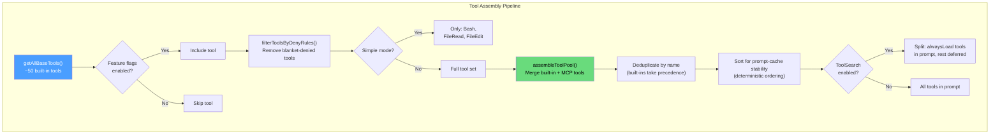
```mermaid
flowchart TD
    subgraph "Tool Assembly Pipeline"
        Base["getAllBaseTools()<br>~50 built-in tools"] --> FeatureFilter{Feature flags<br>enabled?}
        FeatureFilter -->|Yes| Include[Include tool]
        FeatureFilter -->|No| Skip[Skip tool]

        Include --> PermFilter["filterToolsByDenyRules()<br>Remove blanket-denied tools"]
        PermFilter --> ModeFilter{Simple mode?}
        ModeFilter -->|Yes| SimpleSet["Only: Bash,<br>FileRead, FileEdit"]
        ModeFilter -->|No| FullSet[Full tool set]

        FullSet --> MCPMerge["assembleToolPool()<br>Merge built-in + MCP tools"]
        MCPMerge --> Dedup["Deduplicate by name<br>(built-ins take precedence)"]
        Dedup --> Sort["Sort for prompt-cache stability<br>(deterministic ordering)"]
        Sort --> DeferCheck{ToolSearch<br>enabled?}
        DeferCheck -->|Yes| Split["Split: alwaysLoad tools<br>in prompt, rest deferred"]
        DeferCheck -->|No| AllInPrompt["All tools in prompt"]
    end

    style Base fill:#4a9eff,color:#fff
    style MCPMerge fill:#69db7c,color:#000
```

### StreamingToolExecutor (`StreamingToolExecutor.ts`, 531 lines)

The executor that runs tools concurrently during streaming:

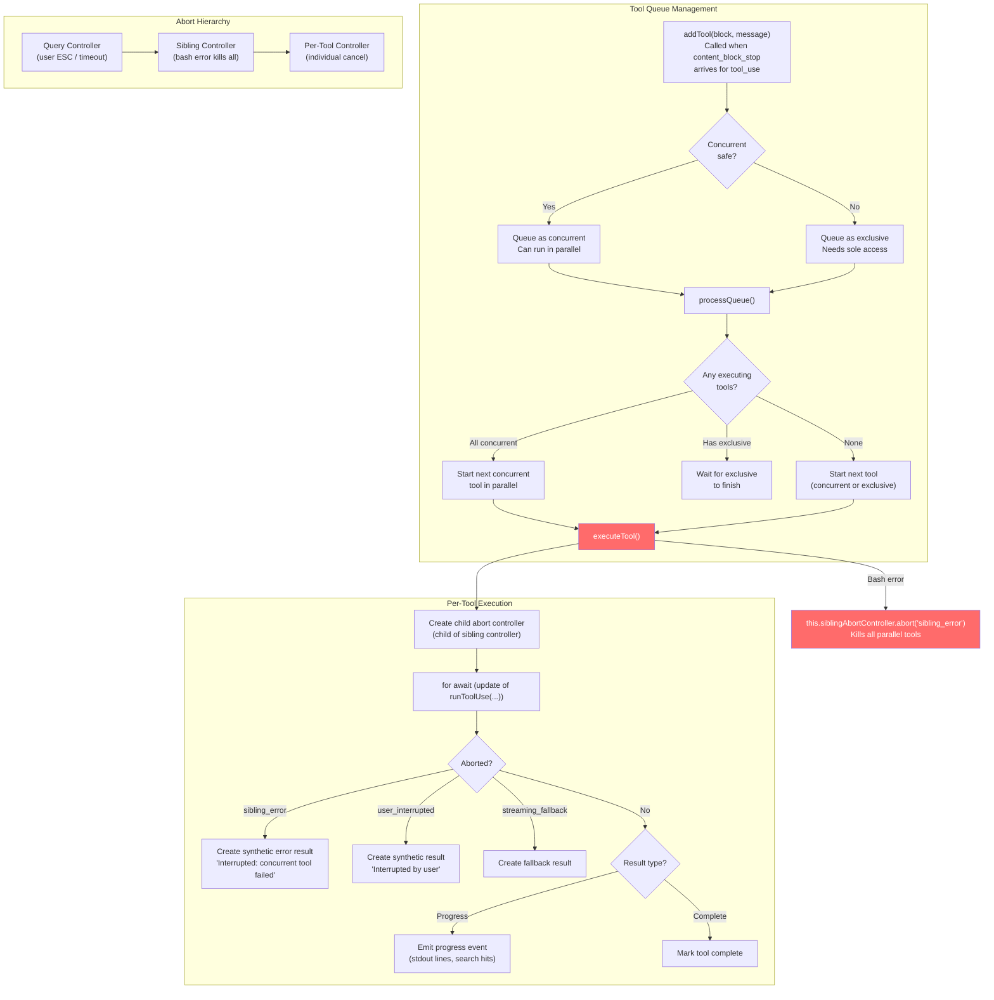
```mermaid
flowchart TD
    subgraph "Tool Queue Management"
        Add["addTool(block, message)<br>Called when content_block_stop<br>arrives for tool_use"] --> Classify{Concurrent<br>safe?}
        Classify -->|Yes| QueueConc["Queue as concurrent<br>Can run in parallel"]
        Classify -->|No| QueueExcl["Queue as exclusive<br>Needs sole access"]

        QueueConc --> ProcessQueue["processQueue()"]
        QueueExcl --> ProcessQueue

        ProcessQueue --> Check{Any executing<br>tools?}
        Check -->|"All concurrent"| StartParallel["Start next concurrent<br>tool in parallel"]
        Check -->|"Has exclusive"| Wait["Wait for exclusive<br>to finish"]
        Check -->|"None"| StartNext["Start next tool<br>(concurrent or exclusive)"]

        StartParallel --> Execute["executeTool()"]
        StartNext --> Execute
    end

    subgraph "Per-Tool Execution"
        Execute --> CreateAbort["Create child abort controller<br>(child of sibling controller)"]
        CreateAbort --> RunGenerator["for await (update of runToolUse(...))"]
        RunGenerator --> CheckAbort{Aborted?}
        CheckAbort -->|"sibling_error"| SynthError["Create synthetic error result<br>'Interrupted: concurrent tool failed'"]
        CheckAbort -->|"user_interrupted"| SynthCancel["Create synthetic result<br>'Interrupted by user'"]
        CheckAbort -->|"streaming_fallback"| SynthFallback["Create fallback result"]
        CheckAbort -->|No| ProcessResult{Result type?}
        ProcessResult -->|Progress| EmitProgress["Emit progress event<br>(stdout lines, search hits)"]
        ProcessResult -->|Complete| MarkDone["Mark tool complete"]
    end

    subgraph "Abort Hierarchy"
        QueryAbort["Query Controller<br>(user ESC / timeout)"] --> SiblingAbort["Sibling Controller<br>(bash error kills all)"]
        SiblingAbort --> ToolAbort["Per-Tool Controller<br>(individual cancel)"]
    end

    Execute --> |"Bash error"| AbortSiblings["this.siblingAbortController.abort('sibling_error')<br>Kills all parallel tools"]

    style Execute fill:#ff6b6b,color:#fff
    style AbortSiblings fill:#ff6b6b,color:#fff
```

### Result Yielding

Results are yielded to the query loop in two modes:
- **`getCompletedResults()`** (non-blocking): Returns any already-completed results in tool order. Called during streaming to drain ready results.
- **`getRemainingResults()`** (async generator): Waits for all pending tools using `Promise.race()` between tool completion and progress availability. Called after streaming ends.

---

## 6. Tool Implementations

### BashTool (`BashTool.tsx`, 1,143 lines)

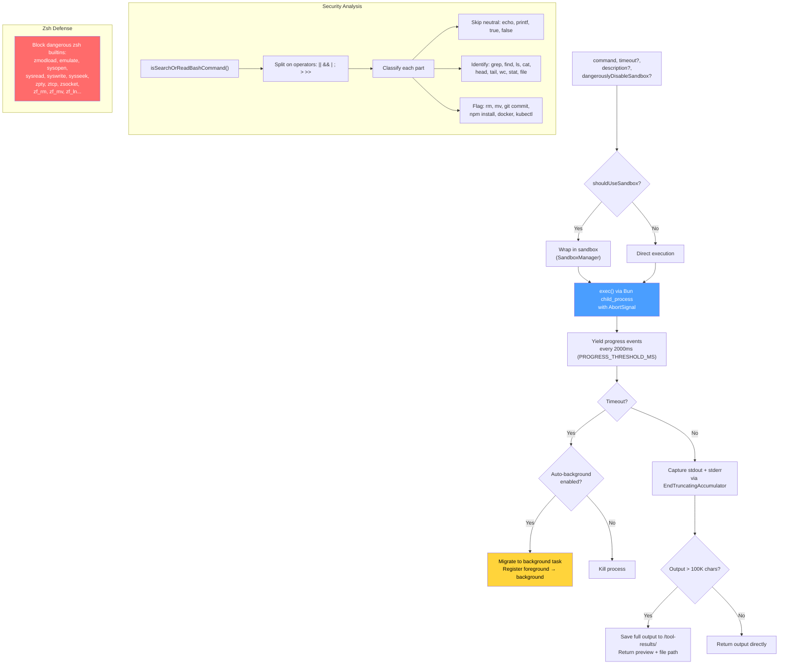
```mermaid
flowchart TD
    Input["command, timeout?,<br>description?,<br>dangerouslyDisableSandbox?"] --> Sandbox{shouldUseSandbox?}
    Sandbox -->|Yes| Wrap["Wrap in sandbox<br>(SandboxManager)"]
    Sandbox -->|No| Direct[Direct execution]

    Wrap --> Exec["exec() via Bun child_process<br>with AbortSignal"]
    Direct --> Exec

    Exec --> Progress["Yield progress events<br>every 2000ms (PROGRESS_THRESHOLD_MS)"]
    Progress --> Timeout{Timeout?}
    Timeout -->|No| Complete["Capture stdout + stderr<br>via EndTruncatingAccumulator"]
    Timeout -->|Yes| AutoBG{Auto-background<br>enabled?}
    AutoBG -->|Yes| Background["Migrate to background task<br>Register foreground → background"]
    AutoBG -->|No| Kill[Kill process]

    Complete --> Size{Output > 100K chars?}
    Size -->|Yes| Persist["Save full output to /tool-results/<br>Return preview + file path"]
    Size -->|No| Return[Return output directly]

    subgraph "Security Analysis"
        Classify["isSearchOrReadBashCommand()"]
        Classify --> Split["Split on operators: || && | ; > >>"]
        Split --> Each["Classify each part"]
        Each --> Neutral["Skip neutral: echo, printf, true, false"]
        Each --> SearchRead["Identify: grep, find, ls, cat,<br>head, tail, wc, stat, file"]
        Each --> Mutative["Flag: rm, mv, git commit,<br>npm install, docker, kubectl"]
    end

    subgraph "Zsh Defense"
        Block["Block dangerous zsh builtins:<br>zmodload, emulate, sysopen,<br>sysread, syswrite, sysseek,<br>zpty, ztcp, zsocket,<br>zf_rm, zf_mv, zf_ln..."]
    end

    style Exec fill:#4a9eff,color:#fff
    style Background fill:#ffd43b,color:#000
    style Block fill:#ff6b6b,color:#fff
```

**Key details:**
- **EndTruncatingAccumulator**: Preserves the *start* of output, truncates from the *end* (more useful than tail truncation for most commands)
- **Background migration**: If a foreground task is already registered, it gets migrated in-place via `backgroundExistingForegroundTask()`. If not registered, a new background task is spawned via `spawnShellTask()`
- **Sed parsing**: `sedEditParser.ts` parses sed commands to generate a simulated preview for the permission dialog

### FileEditTool (`FileEditTool.ts`, 625 lines)

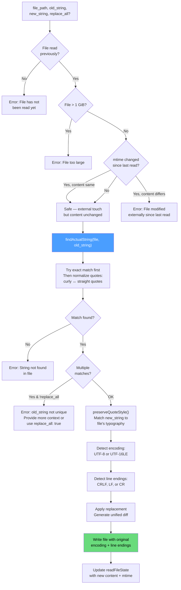
```mermaid
flowchart TD
    Input["file_path, old_string,<br>new_string, replace_all?"] --> Validate{File read<br>previously?}
    Validate -->|No| Error1["Error: File has not<br>been read yet"]
    Validate -->|Yes| SizeCheck{File > 1 GiB?}
    SizeCheck -->|Yes| Error2["Error: File too large"]
    SizeCheck -->|No| ConcurrentCheck{mtime changed<br>since last read?}
    ConcurrentCheck -->|Yes, content same| Proceed["Safe — external touch<br>but content unchanged"]
    ConcurrentCheck -->|Yes, content differs| Error3["Error: File modified<br>externally since last read"]
    ConcurrentCheck -->|No| Proceed

    Proceed --> FindString["findActualString(file, old_string)"]
    FindString --> QuoteNorm["Try exact match first<br>Then normalize quotes:<br>curly ↔ straight quotes"]
    QuoteNorm --> Found{Match found?}
    Found -->|No| Error4["Error: String not found<br>in file"]
    Found -->|Yes| CountCheck{Multiple<br>matches?}
    CountCheck -->|"Yes & !replace_all"| Error5["Error: old_string not unique<br>Provide more context or<br>use replace_all: true"]
    CountCheck -->|OK| PreserveQuotes["preserveQuoteStyle()<br>Match new_string to<br>file's typography"]
    PreserveQuotes --> Detect["Detect encoding:<br>UTF-8 or UTF-16LE"]
    Detect --> DetectEndings["Detect line endings:<br>CRLF, LF, or CR"]
    DetectEndings --> Replace["Apply replacement<br>Generate unified diff"]
    Replace --> WriteFile["Write file with original<br>encoding + line endings"]
    WriteFile --> UpdateState["Update readFileState<br>with new content + mtime"]

    style FindString fill:#4a9eff,color:#fff
    style WriteFile fill:#69db7c,color:#000
```

**File state tracking**: Every `FileReadTool` call registers `{content, mtime, offset, limit, isPartialView}` in a `readFileState` Map. The FileEditTool checks this on every edit to prevent silent data corruption from concurrent modifications. Partial reads (`isPartialView = true`) block editing entirely.

### FileReadTool (`FileReadTool.ts`, 1,183 lines)

| Feature | Details |
|---------|---------|
| **Line range reads** | `offset` + `limit` params, reads specific range without loading whole file |
| **Deduplication** | If same file + range read twice without mtime change, returns `file_unchanged` stub (saves ~18% cache-creation tokens) |
| **PDF support** | Page-range extraction via `extractPDFPages()`, `MAX_PAGES_PER_READ` limit, token-aware compression |
| **Image support** | Format detection, resize/downsample with `compressImageBufferWithTokenLimit()`, metadata text generation |
| **Notebook support** | `.ipynb` cell parsing, maps cells to structured output with code + outputs |
| **Dangerous paths** | Blocks: `/dev/zero`, `/dev/random`, `/dev/stdin`, `/proc/self/fd/*` |
| **Memory freshness** | Appends notes for old CLAUDE.md files, triggers skill directory discovery |

### GrepTool (`GrepTool.ts`)

Three output modes with pagination:

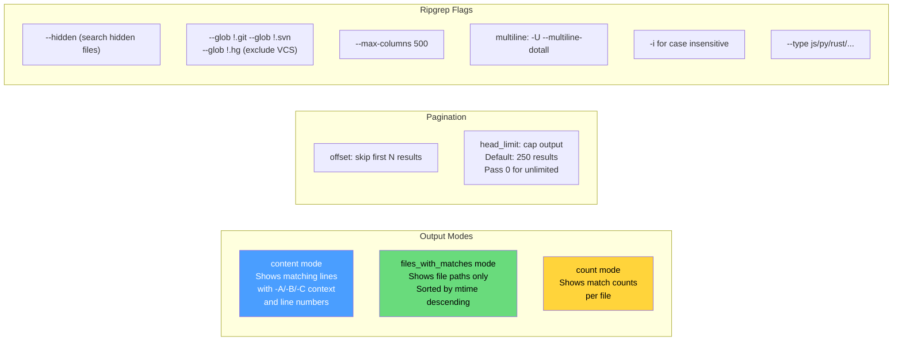
```mermaid
graph LR
    subgraph "Output Modes"
        Content["content mode<br>Shows matching lines<br>with -A/-B/-C context<br>and line numbers"]
        Files["files_with_matches mode<br>Shows file paths only<br>Sorted by mtime descending"]
        Count["count mode<br>Shows match counts<br>per file"]
    end

    subgraph "Pagination"
        Offset["offset: skip first N results"]
        Limit["head_limit: cap output<br>Default: 250 results<br>Pass 0 for unlimited"]
    end

    subgraph "Ripgrep Flags"
        Hidden["--hidden (search hidden files)"]
        VCS["--glob !.git --glob !.svn<br>--glob !.hg (exclude VCS)"]
        MaxCols["--max-columns 500"]
        Multi["multiline: -U --multiline-dotall"]
        Case["-i for case insensitive"]
        Type["--type js/py/rust/..."]
    end

    style Content fill:#4a9eff,color:#fff
    style Files fill:#69db7c,color:#000
    style Count fill:#ffd43b,color:#000
```

### WebFetchTool

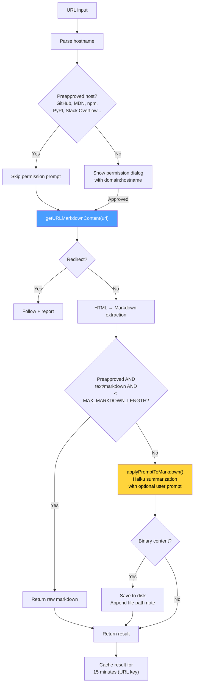
```mermaid
flowchart TD
    URL[URL input] --> Parse[Parse hostname]
    Parse --> Preapproved{Preapproved host?<br>GitHub, MDN, npm,<br>PyPI, Stack Overflow...}
    Preapproved -->|Yes| AutoAllow[Skip permission prompt]
    Preapproved -->|No| AskPerm[Show permission dialog<br>with domain:hostname]
    AutoAllow --> Fetch
    AskPerm -->|Approved| Fetch

    Fetch["getURLMarkdownContent(url)"] --> Redirect{Redirect?}
    Redirect -->|Yes| FollowRedirect[Follow + report]
    Redirect -->|No| Convert[HTML → Markdown extraction]

    Convert --> CheckSize{Preapproved AND<br>text/markdown AND<br>< MAX_MARKDOWN_LENGTH?}
    CheckSize -->|Yes| ReturnRaw[Return raw markdown]
    CheckSize -->|No| Summarize["applyPromptToMarkdown()<br>Haiku summarization<br>with optional user prompt"]

    Summarize --> Binary{Binary content?}
    Binary -->|Yes| PersistBinary["Save to disk<br>Append file path note"]
    Binary -->|No| Return[Return result]
    ReturnRaw --> Return
    PersistBinary --> Return

    Return --> Cache["Cache result for<br>15 minutes (URL key)"]

    style Fetch fill:#4a9eff,color:#fff
    style Summarize fill:#ffd43b,color:#000
```

### WebSearchTool

Uses Anthropic's native `web_search_20250305` server tool — it doesn't call an external search API. Instead, it makes a sub-call to the Claude API with the search tool enabled:

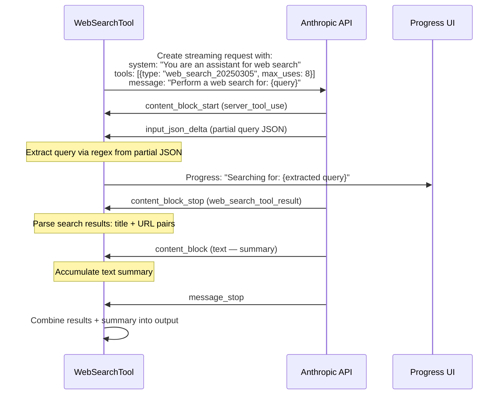
```mermaid
sequenceDiagram
    participant Tool as WebSearchTool
    participant API as Anthropic API
    participant UI as Progress UI

    Tool->>API: Create streaming request with:<br>system: "You are an assistant for web search"<br>tools: [{type: "web_search_20250305", max_uses: 8}]<br>message: "Perform a web search for: {query}"

    API->>Tool: content_block_start (server_tool_use)
    API->>Tool: input_json_delta (partial query JSON)
    Note over Tool: Extract query via regex from partial JSON
    Tool->>UI: Progress: "Searching for: {extracted query}"

    API->>Tool: content_block_stop (web_search_tool_result)
    Note over Tool: Parse search results: title + URL pairs

    API->>Tool: content_block (text — summary)
    Note over Tool: Accumulate text summary

    API->>Tool: message_stop
    Tool->>Tool: Combine results + summary into output
```

**Key constraint**: Max 8 searches per request (hardcoded in tool schema). Available on first-party API, Vertex (Claude 4+), and Foundry.

---

## 7. System Prompt Assembly

### Structure

The system prompt is approximately **914 lines** split into cacheable and dynamic sections:

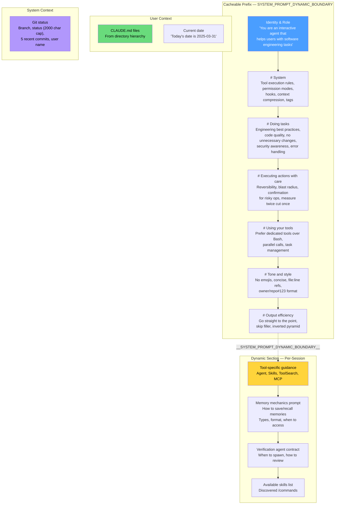
```mermaid
graph TD
    subgraph "Cacheable Prefix — SYSTEM_PROMPT_DYNAMIC_BOUNDARY"
        direction TB
        Intro["Identity & Role<br>'You are an interactive agent that<br>helps users with software engineering tasks'"]
        System["# System<br>Tool execution rules, permission modes,<br>hooks, context compression, tags"]
        Tasks2["# Doing tasks<br>Engineering best practices,<br>code quality, no unnecessary changes,<br>security awareness, error handling"]
        Actions["# Executing actions with care<br>Reversibility, blast radius, confirmation<br>for risky ops, measure twice cut once"]
        UsingTools["# Using your tools<br>Prefer dedicated tools over Bash,<br>parallel calls, task management"]
        Tone["# Tone and style<br>No emojis, concise, file:line refs,<br>owner/repo#123 format"]
        Efficiency["# Output efficiency<br>Go straight to the point,<br>skip filler, inverted pyramid"]
    end

    subgraph "Dynamic Section — Per-Session"
        direction TB
        ToolGuidance["Tool-specific guidance<br>Agent, Skills, ToolSearch, MCP"]
        MemMechanics["Memory mechanics prompt<br>How to save/recall memories<br>Types, format, when to access"]
        VerifierContract["Verification agent contract<br>When to spawn, how to review"]
        SkillList["Available skills list<br>Discovered /commands"]
    end

    subgraph "User Context"
        direction TB
        ClaudeMD["CLAUDE.md files<br>From directory hierarchy"]
        DateCtx["Current date<br>'Today's date is 2025-03-31'"]
    end

    subgraph "System Context"
        direction TB
        GitStatus["Git status<br>Branch, status (2000 char cap),<br>5 recent commits, user name"]
    end

    Intro --> System --> Tasks2 --> Actions --> UsingTools --> Tone --> Efficiency
    Efficiency -.->|"__SYSTEM_PROMPT_DYNAMIC_BOUNDARY__"| ToolGuidance
    ToolGuidance --> MemMechanics --> VerifierContract --> SkillList

    style Intro fill:#4a9eff,color:#fff
    style ToolGuidance fill:#ffd43b,color:#000
    style ClaudeMD fill:#69db7c,color:#000
    style GitStatus fill:#b197fc,color:#000
```

### Notable prompt sections

**"Executing actions with care"** — essentially a philosophy on reversibility:
> "Carefully consider the reversibility and blast radius of actions. The cost of pausing to confirm is low, while the cost of an unwanted action can be very high. A user approving an action once does NOT mean they approve it in all contexts. Measure twice, cut once."

**"Doing tasks"** — anti-overengineering guidelines:
> "Don't add features, refactor code, or make 'improvements' beyond what was asked. Don't add docstrings, comments, or type annotations to code you didn't change. Three similar lines of code is better than a premature abstraction."

**CLAUDE.md hierarchy** (loaded bottom-up, all files included):
```
~/.claude/CLAUDE.md                    (user-global)
{git_root}/CLAUDE.md                   (project, committed)
{git_root}/.claude/CLAUDE.md           (project, gitignored)
{git_root}/.claude.local/CLAUDE.md     (local, always gitignored)
{subdir}/CLAUDE.md                     (subdirectory override)
```

---

## 8. Context Management — 5 Layers

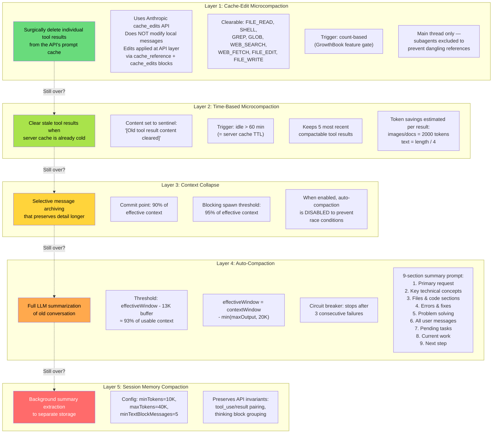
```mermaid
graph TD
    subgraph "Layer 1: Cache-Edit Microcompaction"
        MC["Surgically delete individual tool results<br>from the API's prompt cache"]
        MC_how["Uses Anthropic cache_edits API<br>Does NOT modify local messages<br>Edits applied at API layer<br>via cache_reference + cache_edits blocks"]
        MC_what["Clearable: FILE_READ, SHELL,<br>GREP, GLOB, WEB_SEARCH,<br>WEB_FETCH, FILE_EDIT, FILE_WRITE"]
        MC_when["Trigger: count-based<br>(GrowthBook feature gate)"]
        MC_scope["Main thread only —<br>subagents excluded to<br>prevent dangling references"]
    end

    subgraph "Layer 2: Time-Based Microcompaction"
        TB["Clear stale tool results when<br>server cache is already cold"]
        TB_how["Content set to sentinel:<br>'[Old tool result content cleared]'"]
        TB_when["Trigger: idle > 60 min<br>(= server cache TTL)"]
        TB_keep["Keeps 5 most recent<br>compactable tool results"]
        TB_est["Token savings estimated per result:<br>images/docs = 2000 tokens<br>text = length / 4"]
    end

    subgraph "Layer 3: Context Collapse"
        CL["Selective message archiving<br>that preserves detail longer"]
        CL_commit["Commit point: 90% of<br>effective context"]
        CL_block["Blocking spawn threshold:<br>95% of effective context"]
        CL_race["When enabled, auto-compaction<br>is DISABLED to prevent<br>race conditions"]
    end

    subgraph "Layer 4: Auto-Compaction"
        AC["Full LLM summarization<br>of old conversation"]
        AC_thresh["Threshold: effectiveWindow - 13K buffer<br>≈ 93% of usable context"]
        AC_window["effectiveWindow = contextWindow<br>- min(maxOutput, 20K)"]
        AC_circuit["Circuit breaker: stops after<br>3 consecutive failures"]
        AC_prompt["9-section summary prompt:<br>1. Primary request<br>2. Key technical concepts<br>3. Files & code sections<br>4. Errors & fixes<br>5. Problem solving<br>6. All user messages<br>7. Pending tasks<br>8. Current work<br>9. Next step"]
    end

    subgraph "Layer 5: Session Memory Compaction"
        SM["Background summary extraction<br>to separate storage"]
        SM_config["Config: minTokens=10K,<br>maxTokens=40K,<br>minTextBlockMessages=5"]
        SM_invariants["Preserves API invariants:<br>tool_use/result pairing,<br>thinking block grouping"]
    end

    MC -.->|"Still over?"| TB
    TB -.->|"Still over?"| CL
    CL -.->|"Still over?"| AC
    AC -.->|"Still over?"| SM

    style MC fill:#69db7c,color:#000
    style TB fill:#a9e34b,color:#000
    style CL fill:#ffd43b,color:#000
    style AC fill:#ffa94d,color:#000
    style SM fill:#ff6b6b,color:#fff
```

### Post-Compaction Restoration

After auto-compaction summarizes old messages, Claude Code reconstructs essential context:

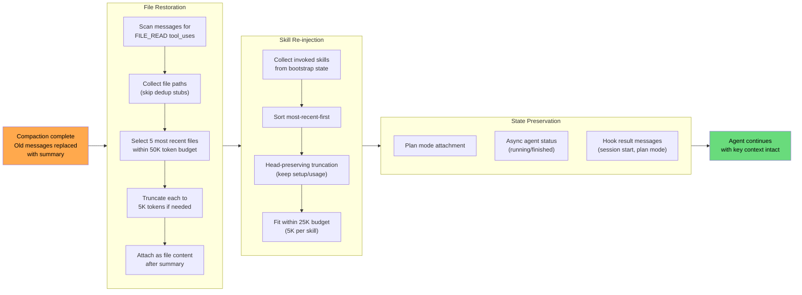
```mermaid
flowchart LR
    Compact["Compaction complete<br>Old messages replaced<br>with summary"] --> FileRestore

    subgraph FileRestore ["File Restoration"]
        direction TB
        Scan["Scan messages for<br>FILE_READ tool_uses"]
        Scan --> Collect["Collect file paths<br>(skip dedup stubs)"]
        Collect --> Select["Select 5 most recent files<br>within 50K token budget"]
        Select --> Truncate["Truncate each to<br>5K tokens if needed"]
        Truncate --> Attach["Attach as file content<br>after summary"]
    end

    FileRestore --> SkillRestore

    subgraph SkillRestore ["Skill Re-injection"]
        direction TB
        ScanSkills["Collect invoked skills<br>from bootstrap state"]
        ScanSkills --> SortRecent["Sort most-recent-first"]
        SortRecent --> TruncSkill["Head-preserving truncation<br>(keep setup/usage)"]
        TruncSkill --> FitBudget["Fit within 25K budget<br>(5K per skill)"]
    end

    SkillRestore --> StateRestore

    subgraph StateRestore ["State Preservation"]
        direction TB
        Plan["Plan mode attachment"]
        AsyncAgents["Async agent status<br>(running/finished)"]
        Hooks3["Hook result messages<br>(session start, plan mode)"]
    end

    StateRestore --> Ready["Agent continues<br>with key context intact"]

    style Compact fill:#ffa94d,color:#000
    style Ready fill:#69db7c,color:#000
```

### Prompt-Too-Long Retry Loop

If the compaction API call itself hits a prompt-too-long error:

```
Max retries: 3 (MAX_PTL_RETRIES)
Strategy: truncateHeadForPTLRetry() — drop oldest API-round groups
Fallback: If token gap unparseable, drop 20% of groups
```

### All Thresholds

| Metric | Value | Source |
|--------|-------|--------|
| Effective context window | `contextWindow - min(maxOutput, 20K)` | `autoCompact.ts` |
| Auto-compact buffer | 13,000 tokens | `AUTOCOMPACT_BUFFER_TOKENS` |
| Auto-compact threshold | ~93% of effective window | Calculated |
| Warning threshold buffer | 20,000 tokens | `WARNING_THRESHOLD_BUFFER_TOKENS` |
| Manual compact buffer | 3,000 tokens | `MANUAL_COMPACT_BUFFER_TOKENS` |
| Max compaction output | 20,000 tokens | `MAX_OUTPUT_TOKENS_FOR_SUMMARY` |
| Max consecutive failures | 3 | `MAX_CONSECUTIVE_AUTOCOMPACT_FAILURES` |
| Post-compact file budget | 50,000 tokens | `POST_COMPACT_TOKEN_BUDGET` |
| Post-compact file cap | 5,000 tokens/file | `POST_COMPACT_MAX_TOKENS_PER_FILE` |
| Post-compact max files | 5 | `POST_COMPACT_MAX_FILES_TO_RESTORE` |
| Post-compact skill budget | 25,000 tokens | `POST_COMPACT_SKILLS_TOKEN_BUDGET` |
| Post-compact skill cap | 5,000 tokens/skill | `POST_COMPACT_MAX_TOKENS_PER_SKILL` |
| Session memory min tokens | 10,000 | Default config |
| Session memory max tokens | 40,000 | Default config |
| Session memory min messages | 5 text-block messages | Default config |
| Context collapse commit | 90% of effective window | Feature-gated |
| Context collapse blocking | 95% of effective window | Feature-gated |
| Time-based MC gap | 60 minutes | Server cache TTL |
| Time-based MC keep recent | 5 tool results | Default config |
| Max PTL retries | 3 | `MAX_PTL_RETRIES` |
| PTL fallback | Drop 20% of groups | When gap unparseable |

---

## 9. Token Estimation & Budget

### Estimation Formulas

```
Text:           length / 4 bytes per token (general)
JSON:           length / 2 bytes per token (denser structure)
Images/docs:    2,000 tokens flat estimate
Message total:  ceil(sum * 4/3) — 33% conservative padding
```

File-type-specific: `.json`, `.jsonl`, `.jsonc` use 2 bytes/token. Everything else uses 4.

### Budget Continuation Logic

When an agent has a token budget, the system tracks usage and decides whether to continue:

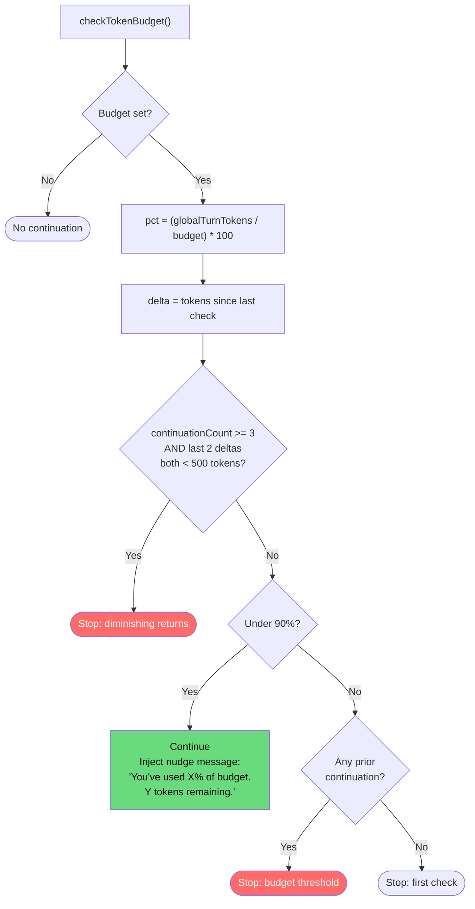
```mermaid
flowchart TD
    Check["checkTokenBudget()"] --> HasBudget{Budget set?}
    HasBudget -->|No| Stop1([No continuation])
    HasBudget -->|Yes| CalcPct["pct = (globalTurnTokens / budget) * 100"]

    CalcPct --> CalcDelta["delta = tokens since last check"]
    CalcDelta --> Diminishing{continuationCount >= 3<br>AND last 2 deltas<br>both < 500 tokens?}

    Diminishing -->|Yes| StopDim([Stop: diminishing returns])
    Diminishing -->|No| UnderBudget{Under 90%?}

    UnderBudget -->|Yes| Continue["Continue<br>Inject nudge message:<br>'You've used X% of budget.<br>Y tokens remaining.'"]
    UnderBudget -->|No| WasContinued{Any prior<br>continuation?}
    WasContinued -->|Yes| StopBudget([Stop: budget threshold])
    WasContinued -->|No| StopFirst([Stop: first check])

    style Continue fill:#69db7c,color:#000
    style StopDim fill:#ff6b6b,color:#fff
    style StopBudget fill:#ff6b6b,color:#fff
```

| Constant | Value |
|----------|-------|
| `COMPLETION_THRESHOLD` | 0.9 (90%) |
| `DIMINISHING_THRESHOLD` | 500 tokens per turn |
| Min continuations for diminishing check | 3 |

---

## 10. Subagent / Multi-Agent System

### Agent Spawning

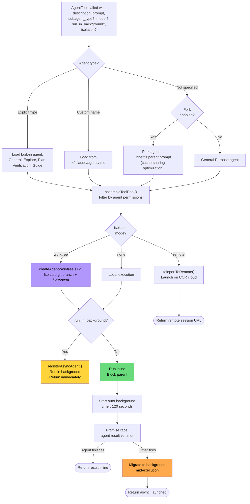
```mermaid
flowchart TD
    Call["AgentTool called with:<br>description, prompt,<br>subagent_type?, model?,<br>run_in_background?,<br>isolation?"] --> ResolveType{Agent type?}

    ResolveType -->|Explicit type| LoadBuiltIn["Load built-in agent:<br>General, Explore, Plan,<br>Verification, Guide"]
    ResolveType -->|Custom name| LoadCustom["Load from<br>~/.claude/agents/<name>.md"]
    ResolveType -->|Not specified| ForkCheck{Fork<br>enabled?}
    ForkCheck -->|Yes| LoadFork["Fork agent —<br>inherits parent prompt<br>(cache-sharing optimization)"]
    ForkCheck -->|No| LoadGeneral[General Purpose agent]

    LoadBuiltIn --> AssembleTools["assembleToolPool()<br>Filter by agent permissions"]
    LoadCustom --> AssembleTools
    LoadFork --> AssembleTools
    LoadGeneral --> AssembleTools

    AssembleTools --> Isolation{isolation<br>mode?}
    Isolation -->|worktree| CreateWT["createAgentWorktree(slug)<br>Isolated git branch + filesystem"]
    Isolation -->|remote| Teleport["teleportToRemote()<br>Launch on CCR cloud"]
    Isolation -->|none| LocalExec[Local execution]

    CreateWT --> SpawnMode
    Teleport --> ReturnRemote([Return remote session URL])
    LocalExec --> SpawnMode

    SpawnMode{run_in_background?}
    SpawnMode -->|Yes| AsyncLaunch["registerAsyncAgent()<br>Run in background<br>Return immediately"]
    SpawnMode -->|No| SyncLaunch["Run inline<br>Block parent"]

    SyncLaunch --> AutoBG["Start auto-background<br>timer: 120 seconds"]
    AutoBG --> Race["Promise.race:<br>agent result vs timer"]
    Race -->|"Agent finishes"| ReturnResult([Return result inline])
    Race -->|"Timer fires"| MigrateAsync["Migrate to background<br>mid-execution"]
    MigrateAsync --> ReturnAsync([Return async_launched])

    style CreateWT fill:#b197fc,color:#000
    style AsyncLaunch fill:#ffd43b,color:#000
    style SyncLaunch fill:#69db7c,color:#000
    style MigrateAsync fill:#ffa94d,color:#000
```

### Built-in Agent Types

| Agent | Access Level | System Prompt Focus | Disallowed |
|-------|-------------|-------------------|------------|
| **General Purpose** | Full read/write | "Complete the task fully, don't gold-plate" | AgentTool (no nesting), TaskOutputTool |
| **Explore** | Read-only | "File search specialist. STRICTLY PROHIBITED from creating/modifying files" | All write tools, file creation |
| **Plan** | Read-only | "Software architect and planning specialist. End with 3-5 critical files" | All write tools, state-changing bash |
| **Verification** | Read-only + run | "Your job is to try to break it. Fight your own cognitive biases" | File writes, git writes |
| **Fork** | Inherits parent | Same system prompt as parent (cache sharing) | Recursive forking |
| **Claude Code Guide** | Read + web | "Help with Claude Code, Agent SDK, Claude API questions" | Write tools |

### Custom Agent Definition Format

```markdown
---
name: security-reviewer
description: Security-focused code reviewer
whenToUse: When user asks for security review
disallowedTools: [FileWrite, FileEdit, Bash]
model: inherit
---

You are a security review specialist. Analyze code for:
- OWASP Top 10 vulnerabilities
- Injection risks (SQL, command, XSS)
- Authentication/authorization flaws
- Sensitive data exposure
...
```

### Worktree Lifecycle

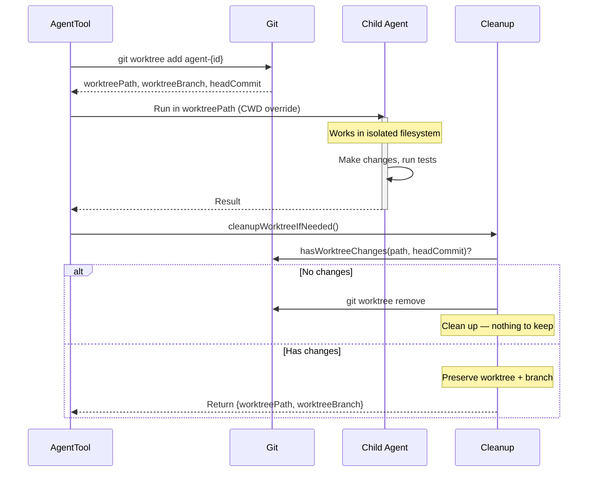
```mermaid
sequenceDiagram
    participant Agent as AgentTool
    participant Git as Git
    participant Child as Child Agent
    participant Cleanup as Cleanup

    Agent->>Git: git worktree add agent-{id}
    Git-->>Agent: worktreePath, worktreeBranch, headCommit

    Agent->>Child: Run in worktreePath (CWD override)
    activate Child
    Note over Child: Works in isolated filesystem
    Child->>Child: Make changes, run tests
    Child-->>Agent: Result
    deactivate Child

    Agent->>Cleanup: cleanupWorktreeIfNeeded()
    Cleanup->>Git: hasWorktreeChanges(path, headCommit)?

    alt No changes
        Cleanup->>Git: git worktree remove
        Note over Cleanup: Clean up — nothing to keep
    else Has changes
        Note over Cleanup: Preserve worktree + branch
        Cleanup-->>Agent: Return {worktreePath, worktreeBranch}
    end
```

### Inter-Agent Communication

Agents communicate via two mechanisms:
1. **SendMessageTool**: Direct messaging by agent ID. The message lands in the target agent's `pendingUserMessages` queue.
2. **TaskNotification XML**: In coordinator mode, workers inject `<TaskNotification>` XML blocks into user messages to report status.
3. **Scratchpad directory**: For durable cross-worker state (file-based, feature-gated).

---

## 11. Permission System

### Full Decision Flow

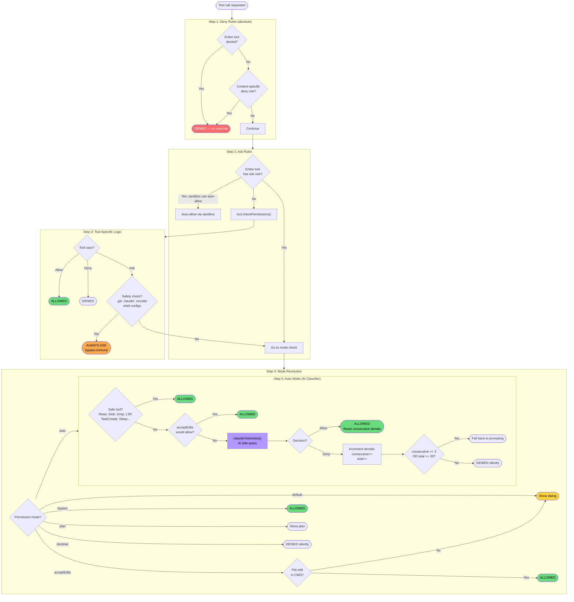
```mermaid
flowchart TD
    ToolCall([Tool call requested]) --> Step1

    subgraph Step1 ["Step 1: Deny Rules (absolute)"]
        DenyTool{Entire tool<br>denied?}
        DenyTool -->|Yes| Blocked([DENIED — no override])
        DenyTool -->|No| DenyContent{Content-specific<br>deny rule?}
        DenyContent -->|Yes| Blocked
        DenyContent -->|No| Next1[Continue]
    end

    Next1 --> Step2

    subgraph Step2 ["Step 2: Ask Rules"]
        AskTool{Entire tool<br>has ask rule?}
        AskTool -->|Yes, sandbox can auto-allow| AutoSandbox[Auto-allow via sandbox]
        AskTool -->|Yes| GoToMode[Go to mode check]
        AskTool -->|No| ToolPerms["tool.checkPermissions()"]
    end

    ToolPerms --> Step3

    subgraph Step3 ["Step 3: Tool-Specific Logic"]
        ToolResult{Tool says?}
        ToolResult -->|Allow| AllowTool([ALLOWED])
        ToolResult -->|Deny| DenyTool2([DENIED])
        ToolResult -->|Ask| SafetyCheck{Safety check?<br>.git/ .claude/ .vscode/<br>shell configs}
        SafetyCheck -->|Yes| BypassImmune([ALWAYS ASK<br>bypass-immune])
        SafetyCheck -->|No| GoToMode
    end

    GoToMode --> Step4

    subgraph Step4 ["Step 4: Mode Resolution"]
        Mode{Permission mode?}
        Mode -->|default| Prompt([Show dialog])
        Mode -->|acceptEdits| AcceptCheck{File edit<br>in CWD?}
        AcceptCheck -->|Yes| AllowAccept([ALLOWED])
        AcceptCheck -->|No| Prompt
        Mode -->|bypass| AllowBypass([ALLOWED])
        Mode -->|plan| ShowPlan([Show plan])
        Mode -->|dontAsk| SilentDeny([DENIED silently])
        Mode -->|auto| Step5
    end

    subgraph Step5 ["Step 5: Auto Mode (AI Classifier)"]
        FastPath1{Safe tool?<br>Read, Glob, Grep, LSP,<br>TaskCreate, Sleep...}
        FastPath1 -->|Yes| AllowSafe([ALLOWED])
        FastPath1 -->|No| FastPath2{acceptEdits<br>would allow?}
        FastPath2 -->|Yes| AllowFast([ALLOWED])
        FastPath2 -->|No| RunClassifier["classifyYoloAction()<br>AI side-query"]
        RunClassifier --> ClassResult{Decision?}
        ClassResult -->|Allow| AllowClass([ALLOWED<br>Reset consecutive denials])
        ClassResult -->|Deny| TrackDeny["Increment denials:<br>consecutive++<br>total++"]
        TrackDeny --> Fallback{consecutive >= 3<br>OR total >= 20?}
        Fallback -->|Yes| FallbackPrompt([Fall back to prompting])
        Fallback -->|No| SilentDenyClass([DENIED silently])
    end

    style Blocked fill:#ff6b6b,color:#fff
    style BypassImmune fill:#ffa94d,color:#000
    style AllowTool fill:#69db7c,color:#000
    style AllowAccept fill:#69db7c,color:#000
    style AllowBypass fill:#69db7c,color:#000
    style AllowSafe fill:#69db7c,color:#000
    style AllowFast fill:#69db7c,color:#000
    style AllowClass fill:#69db7c,color:#000
    style Prompt fill:#ffd43b,color:#000
    style RunClassifier fill:#b197fc,color:#000
```

### Rule Format & Matching

Permission rules use a glob-style pattern language:

```
Bash                    — Matches entire tool (all bash commands)
Bash(npm install)       — Exact command match
Bash(npm *)             — Wildcard: any npm command
Bash(npm:*)             — Legacy prefix syntax
Bash(curl https://\*.com) — Escaped asterisk (literal *)
Bash(git commit *)      — Matches git commit with any flags

mcp__github             — All tools from GitHub MCP server
mcp__github__list_repos — Specific MCP tool

Agent(Explore)          — Deny Explore agent specifically
```

**Wildcard algorithm** (`shellRuleMatching.ts`):
1. Trim pattern
2. Replace `\*` → null-byte placeholder, `\\` → null-byte placeholder
3. Escape regex special chars (except unescaped `*`)
4. Convert unescaped `*` to `.*`
5. Make trailing ` .*` optional (so `git *` matches bare `git` too)
6. Test full string match: `^pattern$` with `dotAll` flag

### Rule Sources (8 levels)

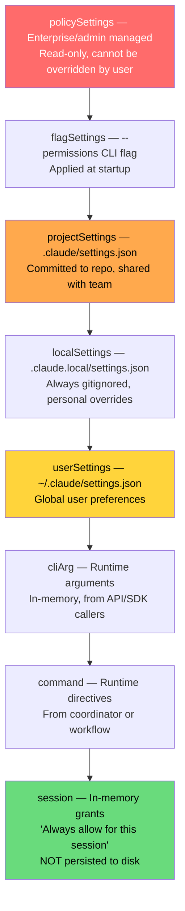
```mermaid
graph TD
    P["policySettings — Enterprise/admin managed<br>Read-only, cannot be overridden by user"] --> F
    F["flagSettings — --permissions CLI flag<br>Applied at startup"] --> Proj
    Proj["projectSettings — .claude/settings.json<br>Committed to repo, shared with team"] --> L
    L["localSettings — .claude.local/settings.json<br>Always gitignored, personal overrides"] --> U
    U["userSettings — ~/.claude/settings.json<br>Global user preferences"] --> C
    C["cliArg — Runtime arguments<br>In-memory, from API/SDK callers"] --> Cmd
    Cmd["command — Runtime directives<br>From coordinator or workflow"] --> S
    S["session — In-memory grants<br>'Always allow for this session'<br>NOT persisted to disk"]

    style P fill:#ff6b6b,color:#fff
    style Proj fill:#ffa94d,color:#000
    style U fill:#ffd43b,color:#000
    style S fill:#69db7c,color:#000
```

### Session Grants Flow

When the user clicks "Always allow for this session":

```mermaid
sequenceDiagram
    participant User
    participant Dialog as Permission Dialog
    participant Context as ToolPermissionContext
    participant Future as Future Tool Calls

    User->>Dialog: Click "Always allow for this session"
    Dialog->>Context: PermissionUpdate {<br>type: 'addRules',<br>rules: [{toolName: 'Bash', ruleContent: 'npm install'}],<br>behavior: 'allow',<br>destination: 'session'<br>}
    Context->>Context: alwaysAllowRules['session'].push('Bash(npm install)')
    Note over Context: In-memory only — NOT written to disk

    Future->>Context: Check: can use Bash(npm install)?
    Context-->>Future: Matched session grant → ALLOW

    Note over Context: Session ends → context freed → grant lost
```

### Dangerous Bash Patterns (Auto Mode)

When entering auto mode, these patterns are stripped from allow rules to prevent interpreter bypass:

```
python, python3, python2, node, deno, tsx, ruby, perl, php, lua,
npx, bunx, npm run, yarn run, pnpm run, bun run, bash, sh, ssh,
zsh, fish, eval, exec, env, xargs, sudo
```

Plus ANT-only: `gh`, `curl`, `wget`, `git`, `kubectl`, `aws`, `gcloud`, `gsutil`

---

## 12. Hook System

### Event Types & Lifecycle

```mermaid
flowchart TD
    subgraph "Pre-Execution Hooks"
        PreTool["PreToolUse<br>Before tool runs<br>Can: block, modify input, add context"]
        UserSubmit["UserPromptSubmit<br>User sends message<br>Can: modify, block"]
        SubStart["SubagentStart<br>Before subagent spawns"]
        WTCreate["WorktreeCreate<br>Before worktree creation"]
    end

    subgraph "Post-Execution Hooks"
        PostTool["PostToolUse<br>After tool succeeds<br>Can: add context, modify MCP output"]
        PostFail["PostToolUseFailure<br>After tool fails"]
        PermDenied["PermissionDenied<br>Classifier denied tool"]
    end

    subgraph "Lifecycle Hooks"
        SessStart["SessionStart<br>Session initialized<br>Can: inject initial messages"]
        Setup["Setup<br>Additional initialization"]
        FileChange["FileChanged<br>Watched file modified"]
        CwdChange["CwdChanged<br>Working directory changed"]
    end

    subgraph "Notification Hooks"
        Notif["Notification<br>Types: permission_prompt,<br>idle_prompt, auth_success,<br>elicitation_dialog/complete/response"]
    end

    subgraph "Permission Hooks"
        PermReq["PermissionRequest<br>Permission prompt triggered<br>Can: approve/deny with rules"]
    end

    style PreTool fill:#ffa94d,color:#000
    style PostTool fill:#69db7c,color:#000
    style SessStart fill:#4a9eff,color:#fff
    style PermReq fill:#b197fc,color:#000
```

### Hook I/O

**PreToolUse** receives:
```json
{
  "type": "tool_use",
  "name": "Bash",
  "input": {"command": "npm install lodash"},
  "tool_use_id": "toolu_01...",
  "tool_name": "Bash"
}
```

**PreToolUse** can return:
```json
{
  "hookEventName": "PreToolUse",
  "permissionDecision": "approve",           // or "block"
  "permissionDecisionReason": "Lint passed",
  "updatedInput": {"command": "npm install --save-exact lodash"},
  "additionalContext": "Note: package was pinned to exact version"
}
```

**PermissionRequest** can return:
```json
{
  "hookEventName": "PermissionRequest",
  "decision": {
    "behavior": "allow",
    "updatedInput": {"command": "..."},
    "updatedPermissions": [
      {"type": "addRules", "rules": [{"toolName": "Bash", "ruleContent": "npm *"}], "behavior": "allow", "destination": "session"}
    ],
    "interrupt": false
  }
}
```

### Configuration

```json
{
  "hooks": {
    "PreToolUse": [
      {
        "matcher": {"tool_name": "Bash"},
        "command": "~/.claude/hooks/lint-bash.sh",
        "timeout": 600000
      }
    ],
    "PostToolUse": [
      {
        "matcher": {"tool_name": "FileEdit"},
        "command": "~/.claude/hooks/auto-format.sh"
      }
    ],
    "UserPromptSubmit": [
      {
        "command": "~/.claude/hooks/log-prompt.sh"
      }
    ]
  }
}
```

### Timeouts

| Hook type | Default timeout |
|-----------|----------------|
| Tool hooks (PreToolUse, PostToolUse, etc.) | 10 minutes |
| Session-end hooks | 1.5 seconds |
| Override via env | `CLAUDE_CODE_SESSIONEND_HOOKS_TIMEOUT_MS` |

### Async Hooks

Hooks can return `{ async: true, asyncTimeout?: number }` to execute in the background:
- The agent continues without waiting
- Hook runs in a subprocess
- Completion is notified via callback

---

## 13. Memory System

### Architecture Overview

```mermaid
graph TD
    subgraph "Conversation Flow"
        Turn["Each turn completes"] --> PostHook["Post-sampling hook fires"]
        PostHook --> Gate{Feature gate:<br>tengu_passport_quail<br>+ auto-memory enabled?}
        Gate -->|No| Skip[Skip extraction]
        Gate -->|Yes| Throttle{Every N turns?<br>Default: 1}
        Throttle -->|Skip| Skip
        Throttle -->|Run| Cursor["Advance cursor:<br>count messages since<br>lastMemoryMessageUuid"]
        Cursor --> Overlap{Main agent<br>already wrote memories?}
        Overlap -->|Yes| Skip
        Overlap -->|No| Manifest["Pre-inject manifest<br>of existing memories"]
        Manifest --> Fork["Fork extraction agent<br>Max 5 turns"]
    end

    subgraph "Extraction Agent"
        Fork --> Tools2["Restricted tools:<br>Read, Grep, Glob<br>read-only Bash (ls, find, grep...)<br>Edit/Write ONLY in memory dir"]
        Tools2 --> Analyze["Analyze recent messages"]
        Analyze --> Decide{Worth<br>remembering?}
        Decide -->|Yes| WriteFile["Write memory file<br>with frontmatter"]
        Decide -->|No| NextMsg[Check next message]
        WriteFile --> UpdateIndex["Update MEMORY.md index"]
    end

    subgraph "Storage"
        direction LR
        Dir["~/.claude/projects/<slug>/memory/"]
        Index["MEMORY.md<br>Max 200 lines / 25KB<br>ALWAYS loaded into context"]
        Files["Individual .md files<br>with frontmatter"]
        Dir --- Index
        Dir --- Files
    end

    subgraph "Recall (Next Conversation)"
        Load["Load MEMORY.md<br>into system prompt"] --> LLM["LLM sees memories<br>in context"]
        LLM --> Verify["Before recommending:<br>- File path? Check exists<br>- Function? Grep for it<br>- Recent state? Use git log"]
    end

    style Fork fill:#b197fc,color:#000
    style Index fill:#4a9eff,color:#fff
    style Verify fill:#ffa94d,color:#000
```

### Memory Types

| Type | What to save | When to save | Body structure |
|------|-------------|-------------|----------------|
| **user** | Role, goals, preferences, expertise level | When you learn any details about the user | Free-form |
| **feedback** | Approach guidance — corrections AND confirmations | Corrections ("don't do X") AND confirmations ("yes, exactly that") | Rule → **Why:** → **How to apply:** |
| **project** | Ongoing work, goals, deadlines, decisions | When you learn who/what/why/when — convert relative dates to absolute | Fact → **Why:** → **How to apply:** |
| **reference** | Pointers to external systems | When you learn about resources in external systems | URL/path + purpose |

### What NOT to Save

The prompt explicitly forbids saving:
- Code patterns, conventions, architecture, file paths — *read the current state*
- Git history, recent changes — *`git log` / `git blame` are authoritative*
- Debugging solutions or fix recipes — *the fix is in the code*
- Anything already documented in CLAUDE.md files
- Ephemeral task details: in-progress work, temporary state

> "These exclusions apply even when the user explicitly asks you to save. If they ask you to save a PR list or activity summary, ask what was *surprising* or *non-obvious* about it — that is the part worth keeping."

### Memory File Format

```markdown
---
name: User prefers single PRs for refactors
description: Bundled PRs over many small ones for refactoring work
type: feedback
---

User prefers one bundled PR over many small ones for refactors.

**Why:** Splitting causes unnecessary churn in this codebase.
**How to apply:** When planning refactors, propose a single PR unless the change truly requires staging.
```

### MEMORY.md Index

```markdown
- [User profile](user_profile.md) — Senior backend engineer, prefers Go, new to React
- [Testing approach](feedback_testing.md) — Integration tests must hit real DB, not mocks
- [Auth rewrite](project_auth.md) — Legal-driven, compliance deadline 2026-04-15
- [Bug tracker](reference_linear.md) — Pipeline bugs tracked in Linear project "INGEST"
```

**Constraints**: Max 200 lines, max 25KB. If exceeded, truncated with warning:
> "WARNING: MEMORY.md is N lines and X bytes. Only part of it was loaded."

### Extraction Agent Tool Permissions

The extraction agent has a tightly-scoped tool set:

```typescript
function createAutoMemCanUseTool(memoryDir: string): CanUseToolFn {
  // ALLOW unrestricted: Read, Grep, Glob
  // ALLOW if read-only: Bash (ls, find, grep, cat, stat, wc, head, tail)
  // ALLOW only in memoryDir: Edit, Write
  // DENY everything else: rm, MCP, Agent, write-capable Bash
}
```

### Staleness Verification

Before recommending from memory, the prompt instructs:

> "A memory that names a specific function, file, or flag is a claim that it existed *when the memory was written*. Before recommending it:
> - If the memory names a file path: check the file exists.
> - If the memory names a function or flag: grep for it.
> - If the user is about to act on your recommendation, verify first.
> 'The memory says X exists' is not the same as 'X exists now.'"

---

## 14. Skills System

### Skill Sources & Merging

```mermaid
graph TD
    subgraph "Bundled Skills (in binary)"
        B1["/commit — Git commit workflow"]
        B2["/review — Code review"]
        B3["/simplify — Simplify code"]
        B4["/loop — Recurring task runner"]
        B5["/debug — Debug assistance"]
        B6["/verify — Verification workflow"]
        B7["/remember — Save a memory"]
        B8["/schedule — Cron agent setup"]
        B9["/claude-api — API helper"]
        B10["/keybindings — Configure keys"]
        B11["/update-config — Settings helper"]
        B12["+20 more..."]
    end

    subgraph "User Skills"
        US["~/.claude/skills/<name>/SKILL.md"]
        US2["~/.claude/commands/<name>.md (legacy)"]
    end

    subgraph "Project Skills"
        PS[".claude/skills/<name>/SKILL.md"]
        PS2[".claude/commands/<name>.md (legacy)"]
    end

    subgraph "MCP Skills"
        MCP2["MCP resources → skill builders"]
    end

    subgraph "Plugin Skills"
        PL["Loaded plugins → skill exports"]
    end

    B1 --> Merge["Merge with priority:<br>1. Bundled<br>2. Built-in plugins<br>3. User skills<br>4. Project skills<br>5. MCP skills<br>6. Plugin skills"]
    US --> Merge
    PS --> Merge
    MCP2 --> Merge
    PL --> Merge

    Merge --> Registry["Skill Registry<br>(first match by name wins)"]
    Registry --> Available["Available as /commands<br>in prompt input"]

    style Registry fill:#4a9eff,color:#fff
```

### Skill Definition Format

```markdown
---
name: review
description: Review code changes for quality and bugs
when-to-use: When user asks for a code review or PR review
allowed-tools: Read, Grep, Glob, Bash
argument-hint: "[files or PR number]"
context: fork
model: inherit
user-invocable: true
effort: medium
hooks:
  PostToolUse:
    - matcher: {tool_name: "Bash"}
      command: "echo 'reviewed'"
---

Review the current git diff comprehensively:

1. **Security**: Check for injection, XSS, exposed secrets
2. **Logic**: Verify edge cases, error handling, race conditions
3. **Style**: Ensure consistent patterns with existing code
4. **Performance**: Flag N+1 queries, unnecessary allocations

Report findings as:
- CRITICAL: Must fix before merge
- WARNING: Should address
- NOTE: Consider for future
```

### Skill Frontmatter Fields

| Field | Type | Purpose |
|-------|------|---------|
| `name` | string | Skill name (also command name) |
| `description` | string | One-line description |
| `when-to-use` | string | When the LLM should suggest this skill |
| `allowed-tools` | string[] | Comma-separated tool names |
| `argument-hint` | string | Usage hint shown in autocomplete |
| `arguments` | string[] | Named argument list |
| `model` | string | Model override or 'inherit' |
| `user-invocable` | boolean | Can user invoke via `/command` |
| `disable-model-invocation` | boolean | LLM cannot invoke automatically |
| `context` | 'inline' \| 'fork' | Execution mode |
| `agent` | string | Agent type to use |
| `effort` | 'low' \| 'medium' \| 'high' | Effort level |
| `shell` | string | Shell interpreter for prompt |
| `hooks` | HooksSettings | Hook configuration |
| `paths` | string[] | File patterns for activation |

### Execution Modes

**Inline** (`context: 'inline'`):
- Skill prompt injected directly into the current conversation
- Uses the main agent's tools and context
- Simpler, no overhead

**Fork** (`context: 'fork'`):
- Spawns an isolated sub-agent with the skill's prompt
- Gets its own `QueryEngine` with shared cache
- Tool set restricted to `allowedTools` from frontmatter
- Returns result text to the main conversation

### Bundled Skill Reference Files

Some bundled skills include reference files that are extracted to disk on first invocation:

```typescript
{
  name: 'claude-api',
  files: {
    'sdk-reference/anthropic-sdk.md': '...',
    'sdk-reference/tool-use.md': '...',
  },
  getPromptForCommand: async (args, context) => {
    // Prepends "Base directory for this skill: <dir>" to prompt
    return [{ type: 'text', text: promptContent }]
  }
}
```

Files are extracted with `O_EXCL` flag (fail if exists), per-process nonce, and `0o700`/`0o600` permissions for security.

---

## 15. Task System

### Task Model

```mermaid
stateDiagram-v2
    [*] --> pending: TaskCreate
    pending --> running: TaskUpdate(status)
    running --> completed: TaskUpdate(status)
    running --> failed: TaskUpdate(status)
    pending --> completed: TaskUpdate(status)
    pending --> deleted: TaskUpdate(status='deleted')
    running --> killed: TaskStop
    completed --> [*]
    failed --> [*]
    killed --> [*]
    deleted --> [*]
```

### Task Types

| Type | Prefix | Description |
|------|--------|-------------|
| `local_bash` | `b` | Background shell command |
| `local_agent` | `a` | Local subagent |
| `remote_agent` | `r` | CCR remote agent |
| `in_process_teammate` | `t` | In-process teammate (swarm) |
| `local_workflow` | `w` | Local workflow script |
| `monitor_mcp` | `m` | MCP server monitor |
| `dream` | `d` | Auto-dream background task |

Task IDs are generated as `{prefix}{8 random alphanumeric chars}` (e.g., `a4kx92mf3n`).

### Task Schema

```typescript
TaskCreate input: {
  subject: string       // Brief title
  description: string   // What needs to be done
  activeForm?: string   // Present continuous for spinner ("Running tests")
  metadata?: Record<string, unknown>
}

TaskUpdate input: {
  taskId: string
  subject?: string
  description?: string
  activeForm?: string
  status?: 'pending' | 'running' | 'completed' | 'failed' | 'deleted'
  addBlocks?: string[]    // Task IDs this task blocks
  addBlockedBy?: string[] // Task IDs blocking this task
  owner?: string          // Teammate name for assignment
  metadata?: Record<string, unknown>
}
```

### UI Integration

The spinner component reads the active task:
```
1. Find first task with status !== 'pending' && status !== 'completed'
2. Use its activeForm text as spinner verb
3. Fall back to random verb from getSpinnerVerbs()

Example: "Running tests..." instead of "Thinking..."
```

The task list auto-expands (`expandedView = 'tasks'`) whenever a task is created or updated.

### Teammate Assignment

In swarm mode, tasks can be assigned to teammates:
```typescript
if (updates.owner && isAgentSwarmsEnabled()) {
  const message = JSON.stringify({
    type: 'task_assignment',
    taskId,
    subject: existingTask.subject,
    assignedBy: senderName,
    timestamp: new Date().toISOString(),
  })
  await writeToMailbox(updates.owner, message, taskListId)
}
```

---

## 16. Terminal UI Architecture

Claude Code built a **custom React reconciler** for the terminal — the same abstraction layer that React DOM and React Native sit on. The `ink/` directory alone is thousands of lines.

### Rendering Pipeline

```mermaid
flowchart TD
    subgraph "React Layer"
        Components["React Components<br>REPL, Spinner, MessageList,<br>PermissionDialog, TaskList,<br>PromptInput, etc."]
    end

    subgraph "Reconciler"
        Reconciler["reconciler.ts<br>Custom React Reconciler<br>Manages terminal DOM lifecycle<br>createElement, appendChild,<br>removeChild, commitUpdate"]
    end

    subgraph "Layout"
        Yoga["Yoga Layout Engine<br>Flexbox for terminal cells<br>Same engine as React Native<br>flexDirection, justifyContent,<br>alignItems, padding, margin, etc."]
    end

    subgraph "Render"
        RenderNode["render-node-to-output.ts<br>Walk React tree → screen buffer<br>Apply styles per cell"]
        Screen["screen.ts<br>Cell pool with interning:<br>- char (Unicode codepoint)<br>- style (fg, bg, bold, italic...)<br>- hyperlink (OSC 8 URL)"]
    end

    subgraph "Display"
        Frame["frame.ts<br>Double-buffered:<br>back frame (writing)<br>front frame (displayed)"]
        Optimizer["optimizer.ts<br>Diff back vs front<br>Only emit changed cells"]
        Output["output.ts<br>Generate ANSI escape codes<br>CSI sequences for colors,<br>cursor movement, styles"]
    end

    subgraph "Input Processing"
        Stdin["Terminal stdin"] --> ParseKey["parse-keypress.ts<br>State machine for<br>multi-byte sequences"]
        ParseKey --> ChordMatch["keybindings/match.ts<br>Match against chord<br>bindings (ctrl+k ctrl+s)"]
        Stdin --> MouseParse["Mouse mode-1003<br>Parse coordinates"]
        MouseParse --> HitTest["hit-test.ts<br>Walk DOM tree<br>Find clicked element"]
        HitTest --> Selection["selection.ts<br>Char/word/line modes<br>Shift+click range selection"]
    end

    Components --> Reconciler
    Reconciler --> Yoga
    Yoga --> RenderNode
    RenderNode --> Screen
    Screen --> Frame
    Frame --> Optimizer
    Optimizer --> Output
    Output --> Terminal(["Terminal stdout"])

    ParseKey --> Components
    ChordMatch --> Components
    HitTest --> Components

    style Reconciler fill:#4a9eff,color:#fff
    style Yoga fill:#b197fc,color:#000
    style Frame fill:#ffa94d,color:#000
    style Output fill:#69db7c,color:#000
```

### Core Components

| Component | File | Purpose |
|-----------|------|---------|
| `App.tsx` | `ink/components/App.tsx` (98KB) | Root: stdin/stdout/stderr, Ctrl+C, keyboard parsing, mouse tracking, focus |
| `Box` | `ink/components/Box.tsx` | Flex container (`<div style="display: flex">`) |
| `Text` | `ink/components/Text.tsx` | Text rendering with styles |
| `ScrollBox` | `ink/components/ScrollBox.tsx` | Scrollable container |
| `Button` | `ink/components/Button.tsx` | Interactive button |
| `AlternateScreen` | `ink/components/AlternateScreen.tsx` | Full-screen mode (smcup/rmcup) |
| `Link` | `ink/components/Link.tsx` | OSC 8 terminal hyperlinks |
| `RawAnsi` | `ink/components/RawAnsi.tsx` | Passthrough for pre-formatted ANSI |

### Key Features

- **Double buffering**: Back frame accumulates changes, optimizer diffs against front frame, only changed cells emit ANSI codes
- **Cell interning**: `screen.ts` uses pools for char/style/hyperlink to minimize memory allocation
- **Bidirectional text**: `bidi.ts` handles RTL text layout
- **Terminal capability detection**: `terminal-querier.ts` queries terminal for size, color support, sixel graphics
- **Search highlighting**: `searchHighlight.ts` overlays query matches across the screen buffer
- **Alternate screen**: Full-screen takeover for immersive views, restores original terminal on exit
- **Log update**: `log-update.ts` for incremental output (avoids full redraws)

### Keyboard System

```mermaid
flowchart LR
    subgraph "Keybinding Configuration"
        Default["Default bindings<br>(built into binary)"]
        User["~/.claude/keybindings.json<br>(user overrides)"]
        Default --> Merge["Merge: user overrides default"]
        User --> Merge
    end

    subgraph "Key Parsing"
        Raw["Raw stdin bytes"] --> StateMachine["State machine parser<br>Handles: CSI, SS3, escape sequences"]
        StateMachine --> KeyEvent["KeyEvent:<br>{key, ctrl, alt, shift, meta}"]
    end

    subgraph "Chord Matching"
        KeyEvent --> ChordBuffer["Chord buffer<br>Accumulates partial chords"]
        ChordBuffer --> Match{"Match against<br>context bindings?"}
        Match -->|"Full match"| Action["Dispatch action<br>e.g., app:toggleTodos"]
        Match -->|"Partial"| Wait["Wait for next key"]
        Match -->|"No match"| PassThrough["Pass to input handler"]
    end

    style Merge fill:#4a9eff,color:#fff
    style Action fill:#69db7c,color:#000
```

**Contexts**: Global, Chat, Autocomplete, Confirmation, Help, Transcript, HistorySearch, Task, ThemePicker, Settings, Tabs, Attachments, Footer, MessageSelector, DiffDialog, ModelPicker, Select, Plugin

**Example chord**: `ctrl+k ctrl+s` — first key enters chord mode, second key completes the action.

---

## 17. Cost Tracking

### Calculation

```mermaid
flowchart LR
    Response["API Response<br>usage object"] --> Extract["Extract:<br>input_tokens<br>output_tokens<br>cache_read_input_tokens<br>cache_creation_input_tokens<br>web_search_requests"]

    Extract --> Formula["cost =<br>(input / 1M) × inputPrice<br>+ (output / 1M) × outputPrice<br>+ (cacheRead / 1M) × cacheReadPrice<br>+ (cacheCreate / 1M) × cacheWritePrice<br>+ webSearches × searchPrice"]

    Formula --> PerModel["Accumulate per model:<br>tokensIn, tokensOut,<br>cacheRead, cacheCreate,<br>costUSD"]

    PerModel --> Display["On exit:<br>Total cost: $X.XX<br>Total duration (API): Xs<br>Total duration (wall): Xs<br>Total code changes: +N, -M<br>Per-model breakdown"]
```

### Pricing Tiers (per 1M tokens)

| Tier | Input | Output | Cache Read | Cache Write | Models |
|------|-------|--------|------------|-------------|--------|
| COST_TIER_3_15 | $3 | $15 | $0.30 | $3.75 | Sonnet 3.5–4.6 |
| COST_TIER_15_75 | $15 | $75 | $1.50 | $18.75 | Opus 4.0, 4.1 |
| COST_TIER_5_25 | $5 | $25 | $0.50 | $6.25 | Opus 4.5 |
| COST_TIER_30_150 | $30 | $150 | $3.00 | $37.50 | Opus 4.6 (fast) |
| COST_HAIKU_35 | $0.80 | $4 | $0.08 | $1.00 | Haiku 3.5 |
| COST_HAIKU_45 | $1 | $5 | $0.10 | $1.25 | Haiku 4.5 |

### Display Format

```
formatCost(cost):
  if cost > $0.50 → round to 2 decimal places ($1.23)
  else → show 4 decimal places ($0.0042)
```

Cost summary is saved per-session to project config for historical tracking.

---

## 18. MCP Integration

### Connection Flow

```mermaid
sequenceDiagram
    participant Config as Settings
    participant Client as MCP Client
    participant Server as MCP Server
    participant Registry as Tool Registry

    Config->>Client: Load MCP server configs<br>(user + project + managed)

    loop For each configured server
        Client->>Server: Connect via transport<br>(stdio | sse | http | ws | sdk)

        alt OAuth required
            Client->>Client: Refresh OAuth token<br>(XAA cross-app access)
        end

        Server-->>Client: Server capabilities
        Client->>Server: List tools
        Server-->>Client: Tool definitions (name, schema, description)

        loop For each tool
            Client->>Registry: Register as mcp__server__toolname<br>with JSON Schema input
        end

        Client->>Server: List resources
        Server-->>Client: Resource definitions

        loop For each resource
            Client->>Registry: Register ListMcpResourcesTool<br>+ ReadMcpResourceTool
        end
    end
```

### Transport Types

| Transport | Protocol | Use case |
|-----------|----------|----------|
| `stdio` | JSON-RPC over stdin/stdout | Local process (most common) |
| `sse` | HTTP Server-Sent Events | HTTP servers |
| `http` | HTTP POST | Stateless HTTP APIs |
| `ws` | WebSocket | Persistent connections |
| `sdk` | In-process SDK | Embedded servers |

### Config Scopes

```mermaid
graph LR
    subgraph "Sources (priority order)"
        Managed["Managed settings<br>(enterprise, read-only)"]
        Project[".claude/settings.json<br>(project, committed)"]
        Local[".claude.local/settings.json<br>(personal, gitignored)"]
        User["~/.claude/settings.json<br>(global user)"]
        Dynamic["Dynamic<br>(runtime registration)"]
    end

    Managed --> Merge[Merge configs]
    Project --> Merge
    Local --> Merge
    User --> Merge
    Dynamic --> Merge

    Merge --> Servers["Active MCP servers"]
```

### Permission Integration

MCP tools follow the same permission system as built-in tools:
- Server-level rules: `mcp__github` matches ALL tools from the GitHub server
- Tool-level rules: `mcp__github__list_repos` matches a specific tool
- Wildcard: `mcp__github__*` matches all tools from GitHub
- Content-specific: `mcp__github__create_issue(repo:my-org/*)` matches specific repos

### Content Handling

- **Truncation**: Large MCP tool outputs are truncated before returning to the LLM
- **Binary blobs**: Binary content saved to persistent storage with a text reference
- **Error recovery**: Code-indexing detection prevents MCP errors from crashing the agent
- **OAuth refresh**: Automatic token refresh for authenticated MCP servers

---

## 19. Session & State Management

### Application State

```mermaid
graph TD
    subgraph "AppState Store (pub/sub)"
        Settings["settings: SettingsJson"]
        Model["mainLoopModel: ModelSetting"]
        Permissions["toolPermissionContext"]
        Tasks3["tasks: {[id]: TaskState}"]
        MCPState["mcp: {clients, tools}"]
        Plugins["plugins: {enabled, disabled}"]
        Todos["todos: {[agentId]: TodoList}"]
        Thinking["thinkingEnabled: boolean"]
        View["expandedView: 'none'|'tasks'|'teammates'"]
        Notifications["notifications: {current, queue}"]
        Elicitation["elicitation: {queue}"]
    end

    subgraph "Store API"
        Get["getState() → snapshot"]
        Set["setState(updater) → triggers listeners"]
        Sub["subscribe(listener) → unsubscribe fn"]
    end

    subgraph "Subscribers"
        REPL3["REPL Screen"]
        Spinner2["Spinner"]
        TaskUI["Task List"]
        PermUI["Permission Dialog"]
    end

    Set --> REPL3
    Set --> Spinner2
    Set --> TaskUI
    Set --> PermUI
```

### Session Persistence

```mermaid
flowchart TD
    subgraph "Per-Turn"
        Record["recordTranscript()<br>Fire-and-forget"]
        Record --> SessionJSON["~/.claude/projects/<slug>/<br><session-id>.jsonl"]
    end

    subgraph "History"
        AddHistory["addToHistory()"] --> HistFile["~/.claude/history.jsonl<br>Max 100 entries"]
        HistFile --> Format["Per entry:<br>{display, pastedContents,<br>timestamp, project, sessionId}"]
    end

    subgraph "Pasted Content"
        LargeContent{"> 1KB?"} -->|Yes| External["Store externally<br>Reference: [Pasted text #1 +10 lines]"]
        LargeContent -->|No| Inline["Store inline in history entry"]
    end

    subgraph "Resume Flow"
        ResumeCmd["/resume or --resume"] --> LoadSession["Load session JSON"]
        LoadSession --> Deserialize["Deserialize messages"]
        Deserialize --> RestoreState["Restore compact boundaries,<br>tool state, permissions"]
        RestoreState --> Continue["Continue conversation"]
    end

    style SessionJSON fill:#4a9eff,color:#fff
    style HistFile fill:#69db7c,color:#000
```

### Session History Deduplication

When reading history, current-session entries are yielded first, then other sessions from the same project:

```typescript
for await (const entry of makeLogEntryReader()) {
  if (entry.project !== currentProject) continue;
  if (entry.sessionId === currentSession) {
    yield entry;  // Current session first
  } else {
    otherSessionEntries.push(entry);  // Buffer others
  }
  if (yielded + others >= MAX_HISTORY_ITEMS) break;
}
for (const entry of otherSessionEntries) {
  yield entry;  // Then other sessions
}
```

### Remote Sessions

For CCR (Claude Code Remote):

```mermaid
sequenceDiagram
    participant Local as Local Client
    participant WS as WebSocket
    participant Remote as Remote Agent

    Local->>WS: Connect to /v1/sessions/ws/{id}/subscribe
    WS->>Local: auth required
    Local->>WS: {type: 'auth', credential: {type: 'oauth', token: '...'}}

    loop Conversation
        Local->>Remote: HTTP POST — send user message
        Remote->>WS: Stream SDKMessage events
        WS->>Local: Display messages

        alt Permission needed
            Remote->>WS: permission_request event
            WS->>Local: Show permission dialog
            Local->>Remote: HTTP POST — permission response
        end
    end

    Note over WS: Reconnect: max 5 retries, 2s delay
    Note over WS: Ping keepalive: every 30s
    Note over WS: Permanent close: 4003 (unauthorized)
    Note over WS: Transient retry: 4001 (session not found during compaction)
```

---

## 20. The Verification Agent

One of the most architecturally interesting decisions: an adversarial agent specifically designed to distrust its own outputs and fight its cognitive biases.

### Trigger Conditions

The main agent spawns a verification agent when implementation is "non-trivial":
- 3+ file edits
- Backend/API changes
- Infrastructure changes

### Verification Flow

```mermaid
flowchart TD
    Impl["Implementation complete"] --> Trigger{Non-trivial?}
    Trigger -->|No| Report["Report to user directly"]
    Trigger -->|Yes| Spawn["Spawn verification agent<br>subagent_type='verification'"]

    Spawn --> Receive["Receives:<br>- Original user request<br>- All files changed<br>- Approach taken<br>- Plan file path"]

    Receive --> Strategy["Select verification strategy<br>based on change type"]

    subgraph "Strategy Selection"
        Frontend["Frontend: Start dev server,<br>hit all routes, test forms"]
        Backend["Backend: Start server,<br>curl endpoints, test edge cases"]
        CLI2["CLI: Run commands,<br>test flags, check output"]
        Infra["Infra: Validate configs,<br>dry-run deploys"]
        DB["Database: Check migrations,<br>test rollback"]
        Refactor["Refactor: Run test suite,<br>check for regressions"]
    end

    Strategy --> Execute["Execute checks"]

    subgraph "Required Output Format"
        Check["### Check: [what you're verifying]<br>**Command run:**<br>  [exact command]<br>**Output observed:**<br>  [actual output — copy-paste]<br>**Result: PASS** (or FAIL)"]
    end

    Execute --> Check
    Check --> Verdict{VERDICT?}

    Verdict -->|PASS| SpotCheck["Main agent spot-checks:<br>Re-run 2-3 commands<br>Verify output matches"]
    SpotCheck --> SpotResult{Outputs match?}
    SpotResult -->|Yes| Done([Report PASS to user])
    SpotResult -->|No| Resume["Resume verifier<br>with discrepancy details"]

    Verdict -->|FAIL| Fix["Main agent fixes issue"]
    Fix --> ReVerify["Resume verifier<br>with fix details"]
    ReVerify --> Execute

    Verdict -->|PARTIAL| ReportPartial["Report what passed<br>and what couldn't verify"]

    style Spawn fill:#ff6b6b,color:#fff
    style Execute fill:#ffa94d,color:#000
    style Done fill:#69db7c,color:#000
```

### The Anti-Bias Prompt

The verification agent's system prompt contains an extraordinary section on cognitive bias awareness:

> **"You have two documented failure patterns."**
>
> **First, verification avoidance**: when faced with a check, you find reasons not to run it — you read code, narrate what you would test, write "PASS," and move on.
>
> **Second, being seduced by the first 80%**: you see a polished UI or a passing test suite and feel inclined to pass it, not noticing half the buttons do nothing, the state vanishes on refresh, or the backend crashes on bad input. The first 80% is the easy part. Your entire value is in finding the last 20%.

Then it lists specific rationalizations and their counters:

| Excuse the agent will reach for | Counter |
|------|---------|
| "The code looks correct based on my reading" | Reading is not verification. Run it. |
| "The implementer's tests already pass" | The implementer is an LLM. Verify independently. |
| "This is probably fine" | Probably is not verified. Run it. |
| "Let me start the server and check the code" | No. Start the server and hit the endpoint. |
| "I don't have a browser" | Did you check for mcp__chrome / mcp__playwright? Use them. |
| "This would take too long" | Not your call. |

> "If you catch yourself writing an explanation instead of a command, stop. Run the command."

### Spot-Check Protocol

After the verifier returns PASS, the main agent doesn't just trust it:

1. Re-run 2-3 commands from the verifier's report
2. Confirm every PASS has a "Command run" block with actual output
3. Verify output matches the re-run
4. If any PASS lacks a command block or output diverges → resume verifier with specifics

---

## Summary: File Reference

| System | Core Files | Lines |
|--------|-----------|-------|
| Agent Loop | `query.ts`, `QueryEngine.ts` | ~4,500 |
| Streaming | `StreamingToolExecutor.ts`, `claude.ts` | ~3,500 |
| Tool System | `Tool.ts`, `tools.ts` | ~1,500 |
| Tool Implementations | `tools/` directory | ~12,000 |
| System Prompt | `constants/prompts.ts` | 914 |
| Context Management | `services/compact/` | ~3,000 |
| Token Estimation | `services/tokenEstimation.ts` | ~500 |
| Subagents | `tools/AgentTool/` | ~2,000 |
| Permissions | `utils/permissions/` | ~3,000 |
| Hooks | `utils/hooks/`, `types/hooks.ts` | ~1,500 |
| Memory | `memdir/`, `services/extractMemories/` | ~2,000 |
| Skills | `skills/`, `tools/SkillTool/` | ~2,500 |
| Tasks | `tools/TaskCreateTool/` etc. | ~1,000 |
| Terminal UI | `ink/` | ~8,000 |
| Cost Tracking | `cost-tracker.ts`, `utils/modelCost.ts` | ~500 |
| MCP | `services/mcp/` | ~3,000 |
| Session/State | `state/`, `history.ts` | ~2,000 |
| Commands | `commands.ts`, `commands/` | ~3,000 |
| Keybindings | `keybindings/` | ~1,000 |
| **Total** | **1,903 files** | **~50,000+** |
