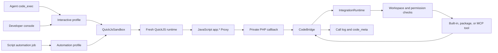

# QuickJS Code Mode Migration

Status: Approved direction; implementation plan only. OpenCompany will make a
hard cut from the current Lua/Luau runtime to synchronous JavaScript on
`OpenCompanyApp/quickjs-sandbox`. No compatibility runtime or dual-language
period will be retained.

Verified against `dev` at `93895a1` on 2026-08-09. The QuickJS extension
contract and v1.0.0 release assets were also verified locally before this plan
was written.

## Decision

OpenCompany will expose **Code Mode** as the product capability and
**JavaScript (QuickJS)** as its only scripting language:

- Agent-facing tools become `code_exec`, `code_list_docs`, `code_read_doc`, and
  `code_search_docs`.
- The stable script API remains the synchronous `app.*` namespace.
- The developer surface becomes **JavaScript Console**, backed by QuickJS.
- Script automations keep the generic `execution_type = script` and `script`
  persistence fields, but new scripts are marked `quickjs-v1`.
- All active Lua classes, tool names, routes, prompts, UI labels, metadata keys,
  documentation directories, native extension wiring, and tests are removed or
  renamed in the cutover.
- Existing Lua scripts are preserved as source text but disabled. OpenCompany
  will not guess at an automatic translation and will never execute them as
  JavaScript.

This is deliberately a breaking change. OpenCompany is still in its prototype
phase, so carrying a Lua compatibility layer would create more long-term cost
and attack surface than it saves.

## Goals

1. Replace the native Lua/Luau runtime with the released Rust-backed
   `quickjs_sandbox` PHP extension.
2. Preserve OpenCompany's permission, workspace, account-alias, tool dispatch,
   and call-log boundaries behind `app.*`.
3. Give agents and automation authors standard, synchronous JavaScript syntax,
   built-in `JSON`, and built-in `RegExp`.
4. Put server-owned limits around JavaScript CPU, memory, stack, source, output,
   callbacks, and total execution time.
5. Remove Lua-specific ownership from the shared integrations package rather
   than recreating it inside OpenCompany.
6. Ship one clean cutover with explicit data handling, deployment checks,
   rollback conditions, and a zero-Lua acceptance gate for active code.

## Non-goals

- Node.js, npm packages, CommonJS, ES modules, `require()`, or dynamic imports.
- `Promise`, `async`/`await`, timers, or a background JavaScript job loop.
- Direct filesystem, network, process, environment, database, or secret access.
- General browser JavaScript or DOM APIs.
- Automatic Lua-to-JavaScript source translation.
- A user-selectable scripting engine or a permanent engine abstraction matrix.
- Treating an in-process language sandbox as an operating-system isolation
  boundary.

## Verified Baseline

The current implementation is not only a sandbox class. Lua is part of the
agent contract, integration packages, automations, observability, UI, routes,
deployment image, and documentation.

| Surface | Current state on `dev` | Required cutover |
|---|---|---|
| Native runtime | `Lua\Sandbox`, installed from `OpenCompanyApp/lua-sandbox` in `Dockerfile` | `QuickJS\Sandbox` from `OpenCompanyApp/quickjs-sandbox` v1.0.0 |
| Application runtime | `LuaSandboxService`, `LuaBridge`, `LuaResult`, `OpenCompanyLuaToolInvoker` | Code Mode classes with a QuickJS-specific sandbox adapter |
| Agent tools | `lua_exec`, `lua_list_docs`, `lua_read_doc`, `lua_search_docs` | `code_exec`, `code_list_docs`, `code_read_doc`, `code_search_docs` |
| Tool catalog | `luaNamespace`, `luaDocs`, `luaFunction` | `scriptNamespace`, `scriptDocs`, `scriptFunction` |
| Integration core | Four Lua-specific core files and `ToolProvider::luaDocsPath()` | Language-neutral script catalog, docs, bridge, and invoker contracts |
| Integration docs | 639 providers and 639 `lua-docs/*.md` files in the sibling repository | `scriptDocsPath()` and JavaScript examples under `script-docs/` |
| Static app docs | Five files under `resources/lua-docs/` | JavaScript Code Mode docs under `resources/code-docs/` |
| Console | `/developer/lua-console`, `/api/lua/execute`, `LuaConsole.vue` | `/developer/code-console`, `/api/code/execute`, `CodeConsole.vue` |
| Automations | Generic `script` column, but scripts execute as Luau and Monaco labels them Luau | Preserve generic storage; execute only `quickjs-v1` JavaScript |
| Traces | `__LUA_META__`, `lua_meta`, `LuaExecutionDetail.vue` | `__CODE_META__`, `code_meta`, `CodeExecutionDetail.vue` |
| Tests | Lua-named unit/feature coverage | QuickJS and Code Mode coverage plus cutover checks |

At this snapshot, 64 active runtime/UI/test files in OpenCompany contain Lua
references. The sibling `integrations` checkout contains 639
`luaDocsPath()` implementations and 639 matching Lua documentation files. The
sibling checkout also has unrelated uncommitted work, so implementation must
start from a separate clean worktree there.

## Naming and Ownership

Use engine-specific names only where code directly touches the native runtime.
Use language-neutral names for the product, shared catalog, and execution
metadata.

| Boundary | Target name |
|---|---|
| Product capability | Code Mode |
| User-visible language | JavaScript |
| Runtime/diagnostics | QuickJS Sandbox |
| Native extension | `quickjs_sandbox` / Composer platform package `ext-quickjs_sandbox` |
| Agent tool group | `code` |
| Shared package contracts | `ScriptCatalogBuilder`, `ScriptDocRenderer`, `ScriptBridge`, `ScriptToolInvoker` |
| App runtime adapter | `QuickJsSandbox` |
| App orchestration | `CodeBridge`, `CodeApiDocGenerator`, `CodeExecutionResult` |
| Trace metadata | `code_meta` |

The shared `integrations` repository owns generic tool metadata, parameter
mapping, account aliases, supplementary script docs, and bridge dispatch. The
OpenCompany application owns the native QuickJS adapter, server-side budgets,
workspace-scoped invocation through `IntegrationRuntime`, agent prompts,
automations, HTTP/UI surfaces, and operational installation.

Do not patch `vendor/`. OpenCompany must consume the coordinated
`integration-core` change through the existing sibling path repositories during
development and through the normal package/catalog release path for deployment.

## Target Runtime Flow



Every execution receives a new QuickJS runtime and global object. JavaScript
gets language primitives and only the host capabilities explicitly installed
for that call. `IntegrationRuntime` remains mandatory: neither the JavaScript
adapter nor the shared bridge may instantiate or invoke tools directly.

## JavaScript Contract

### Script shape

`QuickJS\Sandbox::load()` compiles a strict JavaScript function body. Top-level
`return` is therefore valid, and code is synchronous:

```js
const issues = app.integrations.github.list_issues({
  owner: "OpenCompanyApp",
  repo: "opencompany",
  state: "open",
});

const urgent = issues.filter((issue) => issue.labels.includes("urgent"));
print({ count: urgent.length, urgent });

return urgent.map(({ number, title }) => ({ number, title }));
```

The common call style is one ordinary JavaScript object containing named
arguments. Positional calls remain supported by the shared parameter map for
small convenience calls, but generated docs lead with named objects.

Namespaces that are not legal identifier chains use bracket access:

```js
const slots = app.integrations["acuity-scheduling"].list_appointments({
  max: 20,
});
```

### Globals

Only these globals are application-owned:

- `app`: recursive synchronous proxy into approved OpenCompany tools.
- `ctx`: structured, non-secret execution context supplied by the caller.
- `print(...values)`: bounded output capture with readable serialization.
- `dump(value)`: prints one value and returns it unchanged.

JavaScript's built-in `JSON` and `RegExp` replace the PHP-backed `json.*` and
`regex.*` Lua helpers. No equivalent compatibility helpers will be added.

The docs must explicitly cover the extension's value boundary:

- PHP lists become JavaScript arrays; associative arrays become
  null-prototype objects.
- JavaScript arrays and plain/null-prototype objects can return to PHP.
- Functions, symbols, proxies, promises, dates, maps, sets, cycles, invalid
  UTF-8, and overly large/deep graphs cannot cross the PHP boundary.
- PHP integers outside JavaScript's safe number range arrive as `BigInt`, and a
  returned `BigInt` must fit in a signed PHP 64-bit integer.
- Use `Object.hasOwn(value, key)` rather than calling `value.hasOwnProperty()`,
  because host result objects intentionally have no inherited prototype.

### Private host bridge

The PHP callback namespace must not remain discoverable from user code. Compile
and execute a trusted bootstrap as its own script: capture the callback in a
closure, install the public proxy, and delete the callback's global property.
Only after that script returns may the adapter compile the untrusted source as
a second script in the same sandbox. Never concatenate bootstrap and user
source, because that would put untrusted code in the callback's lexical scope.
This two-script pattern has been smoke-tested against `quickjs_sandbox` v1.0.0:

```js
const host = globalThis.__oc_host;

const makeNamespace = (path = []) => new Proxy(function () {}, {
  get(_target, key) {
    if (key === "then") return undefined;
    return makeNamespace([...path, String(key)]);
  },
  apply(_target, _thisArg, args) {
    return host.call(path.join("."), ...args);
  },
});

delete globalThis.__oc_host;
globalThis.app = makeNamespace();
```

After this bootstrap returns, a separately loaded user script sees both
`globalThis.__oc_host` and the bootstrap-local `host` as `undefined`, while the
closure-backed `app.*` proxy remains functional. The real bootstrap also
installs bounded `print`/`dump`, makes public helper properties non-writable
where practical, and catches host-call failures only to add stable callsite
context. It must not convert authorization or tool failures into a successful
sentinel result.

## PHP Runtime Design

Create a focused bounded context under `app/Domain/CodeExecution`:

```text
app/Domain/CodeExecution/
├── Application/
│   └── ExecuteCode.php
├── Contracts/
│   └── CodeExecutionProfile.php
├── Support/
│   ├── CodeApiDocGenerator.php
│   ├── CodeBridge.php
│   ├── CodeExecutionResult.php
│   ├── CodeMetaParser.php
│   └── OpenCompanyScriptToolInvoker.php
└── Runtime/
    └── QuickJsSandbox.php
```

The exact namespace may be flattened if Laravel dependency injection becomes
needlessly noisy, but the ownership must remain explicit:

- `QuickJsSandbox` alone knows `QuickJS\Sandbox`, its bootstrap source, and its
  typed exceptions.
- `CodeBridge` alone maps `app.*` paths to the shared script bridge and exposes
  its structured call log.
- `OpenCompanyScriptToolInvoker` alone crosses into `IntegrationRuntime` with
  the current agent/workspace/account context.
- `CodeApiDocGenerator` produces JavaScript signatures and resolves
  supplementary docs; it does not execute tools.
- `CodeExecutionResult` carries output, return value, error type/message,
  elapsed wall time, QuickJS CPU time, current/peak memory, and bridge calls.
- Callers select a named server-owned profile. Raw limit overrides are never
  accepted from an LLM or HTTP request.

The adapter skeleton is intentionally small:

```php
final class QuickJsSandbox
{
    public function execute(
        string $source,
        CodeExecutionProfile $profile,
        ?CodeBridge $bridge = null,
        array $globals = [],
    ): CodeExecutionResult {
        $sandbox = new \QuickJS\Sandbox(
            memory_limit: $profile->memoryBytes,
            cpu_limit: $profile->cpuSeconds,
            stack_limit: $profile->stackBytes,
        );

        foreach ($globals as $name => $value) {
            $sandbox->setGlobal($name, $value);
        }

        // Register the private capability, execute a trusted bootstrap, then
        // compile user source separately and map typed QuickJS failures.
    }
}
```

Catch and classify the exact v1.0.0 exception surface:

- `QuickJS\SyntaxException` -> `syntax`
- `QuickJS\TimeoutException` -> `cpu_limit`
- `QuickJS\MemoryException` -> `memory_limit`
- `QuickJS\StackException` -> `stack_limit`
- `QuickJS\ConversionException` -> `conversion`
- `QuickJS\CallbackException` -> `callback`
- `QuickJS\RuntimeException` -> `runtime`
- `QuickJS\Exception` -> `engine`

Unexpected PHP throwables remain application failures and are reported through
normal Laravel exception handling. User-facing errors must not include secrets,
credentials, internal file paths, or arbitrary provider response bodies.

## Resource and Security Policy

Add `config/code_execution.php`. Defaults are server-owned and can be narrowed
by environment configuration, never widened per request.

| Budget | Interactive tool/console | Automation | Enforcement owner |
|---|---:|---:|---|
| Source | 50,000 bytes | 50,000 bytes | Laravel validation; extension has a 4 MiB backstop |
| QuickJS memory | 32 MiB | 32 MiB | Native allocator limit |
| QuickJS CPU | 5 seconds | 5 seconds | Native interrupt handler |
| Native stack | 512 KiB | 512 KiB | Native stack limit |
| Captured output | 64 KiB | 64 KiB | PHP capture callback |
| Output lines | 1,000 | 1,000 | PHP capture callback |
| `app.*` calls | 50 | 50 | `CodeBridge` before dispatch |
| Total wall time | 30 seconds | 45 seconds | Caller plus checks before/after callbacks |
| Queue timeout | n/a | 60 seconds | Laravel job |

The first implementation should keep one conservative CPU profile. Raise the
automation value only from measured workloads, because deterministic
orchestration should not need 30 seconds of JavaScript CPU.

Important boundary: the QuickJS CPU clock pauses during PHP callbacks and its
allocator does not cover PHP memory. Therefore:

1. `CodeBridge` checks call count and elapsed wall time before every dispatch.
2. `IntegrationRuntime` and provider HTTP clients retain finite connection and
   response timeouts.
3. The bridge checks elapsed wall time again after every return and refuses the
   next call once exhausted.
4. The automation queue timeout remains the outer kill boundary.
5. Callback results and output are bounded before accumulating more PHP data.
6. Every execution uses a fresh sandbox; runtimes are never pooled across users,
   workspaces, agents, or jobs.

QuickJS is an in-process sandbox. A memory-safety defect in PHP, QuickJS-NG,
the Rust binding, or the extension could compromise the PHP worker. The v1
prototype accepts that boundary. Moving execution into an OS-isolated worker is
a separate hardening project if arbitrary external users later receive Code
Mode access.

## Agent Tools and Prompt Contract

Replace the entire `app/Agents/Tools/Lua` directory with
`app/Agents/Tools/Code`:

| Delete | Create | Model-facing name |
|---|---|---|
| `LuaExec` | `CodeExec` | `code_exec` |
| `LuaListDocs` | `CodeListDocs` | `code_list_docs` |
| `LuaReadDoc` | `CodeReadDoc` | `code_read_doc` |
| `LuaSearchDocs` | `CodeSearchDocs` | `code_search_docs` |
| `LuaToolProvider` | `CodeToolProvider` | group `code` |

`code_exec` accepts only `code`. It does not expose memory or CPU knobs to the
model. Its description must state that execution is synchronous, `app.*` is
preloaded, modules and promises are unavailable, relevant docs should be read
first, and `print`/`dump` are available.

Update `ToolRegistry`, `OpenCompanyAgent`, `RespondToChatMessage`, and every
provider prompt fragment to use Code Mode terms and examples. Direct tool
groups become `tasks`, `system`, `agents`, `memory`, `code`, and `web`. The
prompt must never suggest raw upstream API shapes when `code_read_doc` is the
source of truth.

## Shared Integrations Migration

This is a prerequisite PR in `OpenCompanyApp/integrations`, not an app-local
fork. Because the current sibling checkout is dirty, create a separate clean
`feat/quickjs` worktree from its current remote default branch before editing.

1. Rename the four core types:
   - `Contracts/LuaToolInvoker` -> `Contracts/ScriptToolInvoker`
   - `Lua/LuaBridge` -> `Script/ScriptBridge`
   - `Lua/LuaCatalogBuilder` -> `Script/ScriptCatalogBuilder`
   - `Lua/LuaDocRenderer` -> `Script/ScriptDocRenderer`
2. Rename `ToolProvider::luaDocsPath()` to `scriptDocsPath()` with no deprecated
   alias.
3. Update all 639 provider implementations and generation templates.
4. Rename every package `lua-docs/` directory to `script-docs/`.
5. Regenerate the 639 supplementary pages as JavaScript, preserving API
   semantics and package-specific gotchas.
6. Update `build-catalog.php`, package generators, catalog metadata, core tests,
   README material, and KosmoKrator consumers in the same coordinated series.
7. Release/version the changed integration core and catalog before the final
   OpenCompany deployment build.

Do not rely on a global regex replacement for documentation correctness. Add a
repeatable migration/validation script that:

- converts standard table/object, local declaration, concatenation, loop,
  conditional, protected-call, and null-value patterns;
- parses every JavaScript fenced block with the QuickJS extension;
- installs a stub recursive `app.*` proxy for compile/smoke validation;
- validates referenced namespace/function paths against the generated catalog;
- rejects Lua fences and high-confidence Lua-only tokens;
- emits a review list for examples whose semantics cannot be proven.

Generated documentation and provider methods must be regenerated from source
templates so the next package catalog build cannot reintroduce Lua.

## Catalog and Documentation

Within OpenCompany:

- Rename `LuaApiDocGenerator` to `CodeApiDocGenerator`.
- Rename `resources/lua-docs/` to `resources/code-docs/` and rewrite all five
  pages in JavaScript.
- Change catalog response keys to `scriptNamespace`, `scriptDocs`, and
  `scriptFunction`.
- Render JavaScript signatures as
  `app.namespace.function({ required, optional? })`.
- Update `resources/js/Pages/Developer/Tools.vue` to consume the new keys.
- Replace `useLuaCompletions.ts` with `useCodeCompletions.ts` and use Monaco's
  built-in JavaScript language mode.
- Update current architecture, ecosystem, UI, and planning documentation.
- Mark `docs/planning/lua-scripting.md` as superseded initially, then remove it
  in the implementation PR once the new plan is the canonical history.

Historical imported research may retain quotations or descriptions of other
systems. Active OpenCompany code, tests, prompts, runtime docs, UI docs, and
package authoring docs may not retain Lua names.

## HTTP and Developer UI

Make a hard route cut:

- `POST /api/code/execute` handled by `CodeConsoleController`.
- `GET /w/{workspace}/developer/code-console` named
  `developer.code-console` and rendered by `Developer/CodeConsole.vue`.
- Remove the old routes; do not add redirects or aliases.
- Run `npm run wayfinder:generate` and commit the generated route/action files.

The console keeps its current workspace and authorization boundary, switches
Monaco to `javascript`, labels the engine `QuickJS`, links to the Code Mode API
reference, and renders output, typed errors, return values, CPU/wall time, and
current/peak memory. It cannot accept client-supplied resource limits.

Automation Create/Edit uses JavaScript syntax, completion data generated from
the same catalog, and a `JavaScript` badge. Dark-mode behavior must remain
unchanged.

## Automations and Persisted Data

Keep the existing generic `execution_type = script` and `script` column. Add a
nullable `script_runtime` column with the only accepted new value
`quickjs-v1`. This is a data-safety marker, not a multi-runtime dispatch
mechanism.

The deployment migration must:

1. Add `script_runtime` as nullable.
2. Find every existing script automation, set `is_active = false`, and leave
   its source and previous `last_result` untouched.
3. Let the UI infer `script_runtime_migration_required` from a script row whose
   runtime marker is null; do not overwrite its previous run record.
4. Leave prompt automations unchanged.
5. Never label an existing script `quickjs-v1` automatically.

Creation of a JavaScript automation sets `script_runtime = quickjs-v1` on the
server. Editing/replacing an old script sets the marker only after validation.
Execution refuses missing or unknown runtime markers before creating bridge
side effects. The UI shows disabled legacy scripts as requiring a JavaScript
rewrite and does not offer a “run anyway” path.

`ExecuteScriptAutomation` remains language-neutral at the automation boundary,
but injects `ctx` using `setGlobal()` rather than constructing source literals.
The result continues to record output, return value, timing, memory, bridge
calls, and tool-call count. Add `runtime = quickjs-v1`, typed error code,
QuickJS CPU time, and peak memory.

No automatic source translation is attempted because these semantics differ in
ways that can silently change external side effects: indexing, truthiness,
iteration order, null handling, error handling, pattern matching, table/object
shape, integer precision, and string concatenation.

## Execution Traces and Observability

Replace language-specific trace plumbing:

- `<!--__LUA_META__...__LUA_META__-->` ->
  `<!--__CODE_META__...__CODE_META__-->`
- `LuaMetaParser` -> `CodeMetaParser`
- task step `lua_meta` -> `code_meta`
- `LuaExecutionDetail.vue` -> `CodeExecutionDetail.vue`
- “Executed Lua script” -> “Executed JavaScript”

Keep metadata extraction before `OutputTruncator`, as today, so structured call
details survive human-output truncation. Include runtime version and normalized
failure type in `code_meta`.

Historical steps with `lua_meta` receive no specialized renderer after the hard
cut; their ordinary stored tool output remains available. Do not carry a legacy
parser in active runtime code just to decorate prototype history.

Add structured logs/metrics for:

- runtime version and execution profile;
- success/failure type;
- wall and JavaScript CPU duration;
- current and peak QuickJS memory;
- output truncation;
- callback count, duration, status, tool slug/group, and account alias presence;
- rejected legacy automation runs.

Never log script context values, credentials, tool arguments, or unrestricted
tool result bodies.

## Native Extension and Docker

Use the released v1.0.0 Linux/PHP 8.4 artifact in the production image:

| Target | Release asset | Verified SHA-256 |
|---|---|---|
| Production, PHP 8.4 Linux x86_64 | `quickjs_sandbox-php84-linux-x86_64.so` | `925c7f290f15292b4e1e113ccb81b823f467b85cfacd6557431c282f19876cb4` |
| Local, PHP 8.5 macOS ARM64 | `quickjs_sandbox-php85-macos-aarch64.so` | `5baeb061ca4ab104651c6bd3f4dbdcd72db70599f934fca72a616b133b69db73` |

```dockerfile
ARG QUICKJS_SANDBOX_VERSION=v1.0.0
ARG QUICKJS_SANDBOX_ASSET=quickjs_sandbox-php84-linux-x86_64.so

RUN curl -fsSLO "https://github.com/OpenCompanyApp/quickjs-sandbox/releases/download/${QUICKJS_SANDBOX_VERSION}/${QUICKJS_SANDBOX_ASSET}" \
    && curl -fsSLO "https://github.com/OpenCompanyApp/quickjs-sandbox/releases/download/${QUICKJS_SANDBOX_VERSION}/${QUICKJS_SANDBOX_ASSET}.sha256" \
    && sha256sum -c "${QUICKJS_SANDBOX_ASSET}.sha256" \
    && install -m 0755 "${QUICKJS_SANDBOX_ASSET}" "$(php-config --extension-dir)/quickjs_sandbox.so" \
    && echo 'extension=quickjs_sandbox.so' > /usr/local/etc/php/conf.d/quickjs-sandbox.ini \
    && php --ri quickjs_sandbox
```

Use an explicit `linux/amd64` assertion while that is the only Linux release
artifact. Do not silently install the x86_64 binary into an ARM image. Add
`ext-quickjs_sandbox` to Composer's platform requirements so application boot
and CI cannot omit the runtime accidentally. Composer's dependency stage may
continue using its deliberate platform-requirement strategy, but the final PHP
image must prove the extension before Laravel cache generation.

Remove `LUA_SANDBOX_VERSION`, `liblua_sandbox.so`, and `lua-sandbox.ini` in the
same commit. Add a small diagnostic command or health check that reports only
extension presence, extension version, engine version, and supported profile
names—never source or runtime globals.

Local macOS development already has QuickJS Sandbox v1.0.0 installed for PHP
8.5. The implementation still needs a setup check/documented installer path so
another developer gets a clear failure instead of skipped tests.

## Test Plan

### Runtime adapter

- top-level return, primitives, arrays, objects, `BigInt`, and `undefined`;
- `ctx` injection through `setGlobal()` with invalid global-name rejection;
- readable bounded `print` and `dump`, including cycles and `BigInt`;
- built-in `JSON` and `RegExp` examples;
- recursive `app.*` proxy, bracket namespaces, named and positional arguments;
- private callback global deleted before user code;
- fresh-runtime isolation and intrinsic/prototype mutation isolation;
- each typed QuickJS exception mapped to a stable result type;
- source, output byte/line, callback-count, wall, CPU, memory, and stack limits;
- invalid UTF-8, cycles, excessive conversion depth/nodes, and unsupported
  boundary values;
- no filesystem, network, process, environment, modules, `require`, imports,
  Promise jobs, or native bytecode capability.

### Bridge and permissions

- unknown path suggestions and structured failed-call logging;
- parameter-name mapping and empty/no-argument tools;
- default and named account aliases;
- workspace scoping for every tool path;
- read/write permission denial before provider dispatch;
- integration, built-in, and MCP dispatch through `IntegrationRuntime`;
- provider exception sanitation and call-log timing;
- callback and total wall budgets across repeated tool calls.

### Agent and docs tools

- Code Mode provider registration and direct-group selection;
- system prompt contains the JavaScript contract and no Lua instructions;
- list/read/search behavior over app and package documentation;
- generated functions and completion entries match the catalog;
- all JavaScript examples compile in QuickJS with a stub `app.*` proxy;
- invalid/unknown namespace and function feedback;
- `code_exec` emits valid `__CODE_META__` and exposes no limit overrides.

### Automations, HTTP, and UI

- existing script automations are preserved, disabled, and unmarked;
- new/edited scripts receive `quickjs-v1` server-side;
- unmarked/unknown runtimes cannot execute or call tools;
- successful, failed, and timed-out scheduled runs record the complete result;
- output posting and task lifecycle behavior remain workspace-scoped;
- API authorization, source validation, and fixed-profile enforcement;
- new routes and generated Wayfinder imports; old routes return 404;
- Monaco JavaScript mode/completions and trace-detail rendering;
- frontend dark-mode regression checks on console and automation editors.

### Build and acceptance

- Docker build verifies the release checksum and `php --ri quickjs_sandbox`;
- PHP 8.4 Linux smoke invokes a script and one registered callback;
- local PHP 8.5 macOS focused suite invokes the installed extension;
- no test is silently skipped when the extension is missing in CI;
- package catalog rebuild is deterministic;
- focused backend tests, frontend typecheck/build, Wayfinder generation, and
  relevant lint/format checks pass.

After migration, this command must return no matches in active owned surfaces:

```bash
rg -n -i '\b(lua|luau|lua_)' \
  app config database resources/js resources/code-docs routes tests Dockerfile composer.json
```

Run an equivalent gate over `integrations/core`, package source,
`script-docs/`, generators, and current package authoring documentation.
Historical imported research is the only intentional exclusion.

## Implementation Sequence

### Phase 0 — Freeze and inventory

1. Create clean `feat/quickjs` worktrees in both repositories.
2. Record the active script automation count per environment without logging
   source.
3. Freeze new Lua-specific package docs and runtime changes while migration is
   in flight.
4. Pin `OpenCompanyApp/quickjs-sandbox` v1.0.0 artifacts and checksums.

Gate: counts, artifact ABIs, deployment architecture, and rollback snapshot are
recorded before code changes.

### Phase 1 — Make integrations language-neutral

1. Rename shared core contracts/classes and provider method.
2. Update generators and all providers.
3. Convert/validate all 639 documentation pages.
4. Update catalog fields, package tests, authoring docs, and other consumers.
5. Release the compatible integration core/catalog set.

Gate: generated catalog is deterministic; all JavaScript examples compile; no
active package source/docs expose Lua contracts.

### Phase 2 — Build the OpenCompany QuickJS bounded context

1. Add config/profiles and extension startup validation.
2. Implement `QuickJsSandbox`, bounded output, typed failures, and metrics.
3. Implement the hidden host callback plus recursive `app.*` proxy.
4. Implement generic bridge/invoker/doc/result classes against the new package
   contracts.
5. Port focused runtime, security, bridge, and doc-generator tests.

Gate: no UI or agent surface changes yet; direct service tests prove the full
security and conversion contract.

### Phase 3 — Cut agent Code Mode and traces

1. Replace Lua tools/provider with Code Mode tools/provider.
2. Rewrite prompts and static docs in JavaScript.
3. Replace metadata marker/parser/listener/UI trace names.
4. Update tool catalog fields and frontend consumers.

Gate: a real agent can read docs, execute multi-call JavaScript, receive normal
permission failures, and inspect structured calls without any Lua tool being
registered.

### Phase 4 — Cut console and automations

1. Add the data migration and `script_runtime` enforcement.
2. Replace console controller/routes/page/completions.
3. Switch automation editors and `ExecuteScriptAutomation` to QuickJS.
4. Regenerate Wayfinder sources.
5. Exercise manual, scheduled, successful, failed, timeout, and disabled-legacy
   automation paths.

Gate: no unmarked source can execute; old routes are absent; new JavaScript
scripts work end-to-end.

### Phase 5 — Replace deployment runtime and remove Lua

1. Replace Docker extension installation with checksummed QuickJS artifacts.
2. Add Composer platform requirement and runtime diagnostic.
3. Delete all superseded Lua classes, assets, docs, tests, and configuration.
4. Run the zero-Lua gates and focused backend/frontend/build checks.
5. Build the exact production image and smoke the native extension inside it.

Gate: the release candidate contains one scripting VM, one Code Mode toolset,
and no active Lua path.

### Phase 6 — Deploy and verify

1. Back up the database and record affected automation IDs/counts.
2. Deploy the integration release and OpenCompany image as one coordinated
   change.
3. Run migrations; confirm legacy scripts were preserved and disabled.
4. Verify extension diagnostics, representative web/API routes, queue workers,
   scheduler, and one read-only Code Mode bridge call.
5. Create and run a disposable JavaScript automation, then remove it.
6. Confirm permission denial, timeout, output truncation, and trace rendering.
7. Monitor failures, worker memory, callback duration, and queue latency.

Gate: application health alone is insufficient; runtime, database, routes,
workers/scheduler, and representative bridge behavior must all pass.

## Commit and PR Shape

Keep review boundaries explicit even if the final deployment is coordinated:

1. `integrations`: rename language-neutral core contracts.
2. `integrations`: convert providers, generators, catalog, and script docs.
3. `opencompany`: add QuickJS runtime/config/tests behind no public surface.
4. `opencompany`: replace agent Code Mode, docs, catalog, and traces.
5. `opencompany`: migrate automations and developer UI/routes.
6. `opencompany`: replace Docker/runtime dependency and delete Lua remnants.
7. `opencompany`: documentation and final zero-Lua verification evidence.

Do not merge a state where OpenCompany expects the new package contract but the
deploy build resolves the old integration core. Either merge/release
integrations first and update the app lock/catalog, or use an explicit temporary
branch reference in the OpenCompany PR and replace it before merge.

## Rollout and Rollback

The application code cutover is atomic. There is no runtime feature flag and no
dual execution.

Before deployment:

- take a restore-tested database backup;
- export affected automation IDs and status/runtime metadata, not secrets;
- retain the prior application image and integration release;
- confirm the target host architecture and PHP ABI match the QuickJS artifact.

Rollback means restoring the prior app image/package set and, if Lua execution
must resume, restoring the pre-migration database snapshot. A code-only rollback
must not reactivate old scripts automatically: the migration deliberately
disabled them to prevent code from running under the wrong language semantics.

## Definition of Done

- QuickJS Sandbox v1.0.0 is checksum-verified and loaded in the production PHP
  8.4 image; local PHP 8.5 remains operational.
- Code Mode is the only script tool and developer surface.
- `app.*` calls retain workspace scoping, permissions, account aliases,
  `IntegrationRuntime` dispatch, and structured call logs.
- Limits cover native JavaScript resources plus PHP-owned output, callback
  count, provider timeouts, and overall wall time.
- Existing scripts are preserved but cannot execute until explicitly rewritten
  and marked `quickjs-v1`.
- Agent prompts, API docs, completion data, console, automation editors, traces,
  and current documentation use synchronous JavaScript.
- Shared integration contracts and all generated package docs are no longer
  Lua-specific.
- Old Lua routes, classes, tools, metadata parser, extension, ini file, docs
  directory, UI components, and tests are deleted.
- All focused tests and production-image smoke checks pass.
- Zero-Lua scans pass in active OpenCompany and integration-package surfaces.
